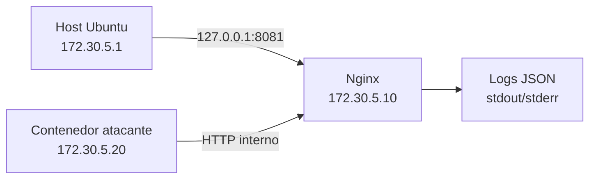
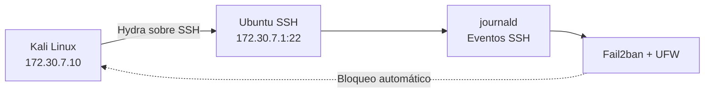

# ATHENA LABS — BASE DE CONOCIMIENTO

Generada: 2026-07-17 23:47:32


---

# CASO-001 — Detección de Conexión SMB con Sysmon

**Fecha del laboratorio:** 5 de julio de 2026  
**Estado:** Completado  
**Clasificación:** Blue Team / Monitoreo de endpoints  
**Proyecto:** Athena Labs

## Resumen ejecutivo

Se construyó un laboratorio aislado en VirtualBox para generar y detectar una conexión de red dirigida al servicio SMB de un equipo Windows 10.

Desde una máquina Kali Linux se comprobó la conectividad con el objetivo y se realizó un escaneo mediante Nmap sobre el puerto TCP/445. En el endpoint Windows, Sysmon registró la actividad como un evento de conexión de red correspondiente al Event ID 3.

El laboratorio permitió validar una secuencia básica de generación, observación y documentación de actividad potencialmente relevante para un analista SOC.

## Objetivos

- Construir un entorno controlado con Kali Linux y Windows 10.
- Comprobar la comunicación entre ambas máquinas.
- Examinar la exposición del servicio SMB sobre TCP/445.
- Generar una conexión de prueba mediante Nmap.
- Detectar la actividad utilizando Sysmon.
- Preservar evidencias de cada etapa del procedimiento.

## Arquitectura del laboratorio

| Componente | Función | Dirección IP |
|---|---|---:|
| Kali Linux | Generación y análisis de actividad | `10.10.10.10` |
| Windows 10 | Endpoint monitoreado | `10.10.10.20` |
| VirtualBox | Plataforma de virtualización | No aplica |
| Red interna | Segmento aislado del laboratorio | `10.10.10.0/24` |

El entorno fue diseñado para que las pruebas se ejecutaran de forma controlada y sin afectar sistemas externos.

## Herramientas utilizadas

- VirtualBox
- Kali Linux
- Windows 10
- Nmap
- Sysmon
- Firewall de Windows
- Visor de eventos de Windows

## Procedimiento

### 1. Preparación del entorno

Se desplegaron las máquinas virtuales Kali Linux y Windows 10 dentro del laboratorio de Athena Labs.

La máquina Kali actuó como origen de la actividad, mientras que Windows 10 funcionó como endpoint objetivo y sistema de monitoreo.

### 2. Comprobación de conectividad

Desde Kali Linux se verificó la comunicación con el equipo Windows antes de realizar el escaneo.

Esta comprobación permitió confirmar que ambas máquinas se encontraban correctamente configuradas dentro del segmento de laboratorio.

### 3. Escaneo del servicio SMB

Se utilizó Nmap para comprobar el estado del puerto TCP/445 del equipo Windows:

```bash
nmap -p 445 10.10.10.20
```

El objetivo fue generar una conexión controlada hacia SMB que pudiera ser observada posteriormente en los registros del endpoint.

4. Configuración del endpoint

En Windows se comprobó la configuración relacionada con SMB y las reglas correspondientes del Firewall de Windows.

Esto permitió que el endpoint recibiera la conexión generada desde Kali dentro del entorno controlado.

5. Detección mediante Sysmon

Sysmon registró la actividad de red mediante el Event ID 3.

Este tipo de evento documenta conexiones de red observadas en el endpoint y puede incluir información como:

Proceso asociado.
Dirección IP de origen.
Dirección IP de destino.
Puerto de origen.
Puerto de destino.
Protocolo utilizado.
Fecha y hora del evento.

La evidencia obtenida permitió relacionar la actividad generada desde Kali Linux con el registro producido en Windows.

Línea temporal
Etapa	Actividad
1	Despliegue del laboratorio en VirtualBox
2	Comprobación de la red desde Kali Linux
3	Escaneo del puerto TCP/445 mediante Nmap
4	Verificación de la configuración SMB en Windows
5	Identificación del Sysmon Event ID 3
Resultado

El laboratorio finalizó satisfactoriamente.

La conexión dirigida al puerto TCP/445 fue generada desde Kali Linux y observada en Windows mediante Sysmon. Esto demostró la utilidad de la telemetría del endpoint para investigar conexiones de red dentro de un flujo básico de monitoreo SOC.

La aparición de un Event ID 3 no demuestra por sí sola la existencia de un ataque. El evento debe correlacionarse con el proceso, las direcciones IP, los puertos, el contexto del activo y otros registros disponibles.

Evidencias
N.º	Evidencia	Descripción
1	01_Athena_Lab_VirtualBox.png	Entorno virtual del laboratorio Athena Labs
2	02_Kali_Network_OK.png	Comprobación de conectividad desde Kali Linux
3	03_Kali_Nmap_SMB445_Scan.png	Escaneo del puerto SMB TCP/445
4	04_Windows_Firewall_SMB445_Enabled.png	Configuración relacionada con SMB en Windows
5	05_SYSmon_EventID3_SMB445_DETECTED.png	Registro de la conexión mediante Sysmon Event ID 3

Las capturas se encuentran en el directorio:

Caso-001-Deteccion-Conexion-SMB-Sysmon/evidencias/
Competencias demostradas
Construcción de laboratorios virtualizados.
Configuración básica de redes aisladas.
Reconocimiento de servicios mediante Nmap.
Monitoreo de conexiones de red con Sysmon.
Análisis inicial de eventos de Windows.
Preservación y organización de evidencias.
Interpretación de telemetría desde una perspectiva Blue Team.
Lecciones aprendidas
La generación controlada de actividad permite validar las fuentes de telemetría.
Sysmon aporta visibilidad adicional sobre las conexiones realizadas por un endpoint.
Un evento aislado requiere contexto antes de ser clasificado como malicioso.
La documentación de cada etapa facilita la reproducción y revisión del laboratorio.
Las evidencias deben relacionarse con una secuencia técnica clara y verificable.
Conclusión

El CASO-001 estableció la primera práctica documentada de Athena Labs orientada a la detección y análisis de actividad de red.

La correlación entre el escaneo originado desde Kali Linux y el evento registrado por Sysmon permitió construir un flujo elemental de trabajo SOC: generar actividad, recopilar telemetría, analizar el evento y conservar evidencias.

Athena Labs
Laboratorios construidos con propósito, evidencia y aprendizaje continuo.


---

# CASO-002 — Reconocimiento de Red Doméstica

**Fecha del laboratorio:** 5 de julio de 2026  
**Estado:** Completado con observación sobre evidencia duplicada  
**Clasificación:** Blue Team / Descubrimiento de activos  
**Proyecto:** Athena Labs

## Resumen ejecutivo

Se realizó un reconocimiento autorizado de la red doméstica `192.168.1.0/24` para identificar hosts activos, fabricantes asociados y servicios potencialmente expuestos.

Mediante Nmap se detectaron cuatro hosts activos. Posteriormente se efectuó una enumeración de servicios TCP sobre el router probable y un análisis de los 20 puertos UDP más comunes sobre un dispositivo identificado por su fabricante como Mega Well Limited.

El laboratorio permitió construir un inventario inicial de activos y documentar las limitaciones propias de la identificación basada en direcciones MAC y resultados `open|filtered`.

## Alcance y autorización

El análisis se realizó exclusivamente sobre la red doméstica propia y dentro de un entorno autorizado.

El objetivo fue educativo y defensivo:

- Identificar dispositivos conectados.
- Reconocer servicios visibles.
- Comprender la superficie de exposición local.
- Documentar hallazgos sin explotar vulnerabilidades.
- Mantener trazabilidad de las evidencias.

## Objetivos

- Descubrir hosts activos en la red `192.168.1.0/24`.
- Asociar fabricantes mediante direcciones MAC.
- Enumerar servicios del router probable.
- Examinar los puertos UDP más comunes del dispositivo Mega Well.
- Construir un inventario inicial de activos.
- Registrar limitaciones y anomalías de la evidencia.

## Herramientas utilizadas

- Kali Linux
- Nmap 7.99
- Descubrimiento de hosts mediante `-sn`
- Detección de servicios mediante `-sV`
- Detección de sistema operativo mediante `-O`
- Escaneo UDP mediante `-sU`
- Identificación de fabricantes mediante direcciones MAC

## Metodología

### 1. Descubrimiento de hosts

Se ejecutó el siguiente comando sobre la red doméstica:

`sudo nmap -sn 192.168.1.0/24`

Nmap examinó 256 direcciones y reportó cuatro hosts activos.

### 2. Enumeración del router probable

Se examinó el host `192.168.1.1` mediante:

`sudo nmap -sV -O 192.168.1.1`

La dirección, el fabricante Fiberhome y los servicios web detectados son compatibles con un router o gateway doméstico.

### 3. Enumeración UDP del dispositivo Mega Well

Se examinaron los 20 puertos UDP más comunes del host `192.168.1.2` mediante:

`sudo nmap -sU --top-ports 20 192.168.1.2`

Los resultados fueron clasificados como `open|filtered`. Este estado significa que Nmap no pudo determinar si el puerto estaba abierto o si un mecanismo de filtrado descartó las sondas.

No debe interpretarse como confirmación definitiva de que todos los servicios enumerados estén activos.

## Inventario de activos observados

| Dirección IP | Fabricante identificado | Clasificación |
|---|---|---|
| `192.168.1.1` | Fiberhome Telecommunication Technologies | Router o gateway probable |
| `192.168.1.2` | Mega Well Limited | Dispositivo de función no confirmada |
| `192.168.1.3` | Samsung Electronics | Dispositivo Samsung no enumerado |
| `192.168.1.6` | No identificado en la captura | Host activo no identificado |

La asociación con un fabricante se obtuvo mediante el prefijo de la dirección MAC. Esto no demuestra por sí solo el modelo, función, propietario ni nivel de seguridad del dispositivo.

## Resultados del router probable

El host `192.168.1.1` presentó:

| Puerto | Estado | Servicio | Identificación de Nmap |
|---:|---|---|---|
| `80/tcp` | Abierto | HTTP | Nginx como reverse proxy |
| `443/tcp` | Abierto | SSL/HTTP | Nginx como reverse proxy |

Nmap también realizó una estimación general de sistema operativo compatible con Linux, con detalles aproximados entre las versiones de kernel 3.10 y 4.11.

La detección de sistema operativo es una estimación y no constituye una identificación exacta.

## Resultados del dispositivo Mega Well

El host `192.168.1.2` presentó los siguientes resultados UDP:

| Puerto | Estado | Servicio sugerido por Nmap |
|---:|---|---|
| `53/udp` | `open|filtered` | domain |
| `67/udp` | `open|filtered` | dhcps |
| `68/udp` | `open|filtered` | dhcpc |
| `69/udp` | `open|filtered` | tftp |
| `123/udp` | `open|filtered` | ntp |
| `135/udp` | `open|filtered` | msrpc |
| `137/udp` | `open|filtered` | netbios-ns |
| `138/udp` | `open|filtered` | netbios-dgm |
| `139/udp` | `open|filtered` | netbios-ssn |
| `161/udp` | `open|filtered` | snmp |
| `162/udp` | `open|filtered` | snmptrap |
| `445/udp` | `open|filtered` | microsoft-ds |
| `500/udp` | `open|filtered` | isakmp |
| `514/udp` | `open|filtered` | syslog |
| `520/udp` | `open|filtered` | route |
| `631/udp` | `open|filtered` | ipp |
| `1434/udp` | `open|filtered` | ms-sql-m |
| `1900/udp` | `open|filtered` | upnp |
| `4500/udp` | `open|filtered` | nat-t-ike |
| `49152/udp` | `open|filtered` | unknown |

Estos nombres corresponden a asociaciones estándar de puertos utilizadas por Nmap. No confirman que cada aplicación esté realmente ejecutándose en el dispositivo.

## Hallazgos principales

### Hallazgo 1 — Servicios administrativos web visibles

El router probable expuso interfaces web mediante TCP/80 y TCP/443 dentro de la red local.

### Hallazgo 2 — Dispositivo Mega Well requiere identificación adicional

La evidencia permitió asociar `192.168.1.2` con Mega Well Limited, pero no confirmó el modelo ni su función específica.

### Hallazgo 3 — Resultados UDP no concluyentes

Los 20 puertos UDP aparecieron como `open|filtered`. Se requerirían pruebas adicionales y respuestas específicas de protocolo para confirmar servicios activos.

### Hallazgo 4 — Dispositivo Samsung descubierto, pero no enumerado

El host `192.168.1.3` fue asociado con Samsung Electronics durante el descubrimiento. No existe una captura válida que demuestre una enumeración de sus puertos o servicios.

### Hallazgo 5 — Host adicional no identificado

El host `192.168.1.6` respondió al descubrimiento, pero la evidencia disponible no permitió establecer fabricante, función o servicios.

## Anomalía documental

Los archivos siguientes tienen exactamente el mismo contenido y hash SHA-256:

- `03_MegaWell_Device_UDP_Enumeration_Nmap.png`
- `04_Samsung_Device_Enumeration_Nmap.png`

Hash compartido:

`3848498a92e6d5897c5966bc48a77fe820a9ae4257640e5b7d39f4f971a8c043`

La evidencia 04 está etiquetada como una enumeración del dispositivo Samsung, pero muestra nuevamente el análisis UDP de `192.168.1.2`, correspondiente a Mega Well.

Por integridad documental:

- No se afirma que el dispositivo Samsung haya sido enumerado.
- No se atribuyen los puertos UDP al host `192.168.1.3`.
- El duplicado se conserva como parte del registro histórico.
- La anomalía queda expresamente documentada.

## Evidencias

| N.º | Archivo | Descripción |
|---:|---|---|
| 1 | `01_Nmap_Host_Discovery.png` | Descubrimiento de cuatro hosts activos |
| 2 | `02_Router_Service_Enumeration_Nmap.png` | Enumeración TCP del router probable |
| 3 | `03_MegaWell_Device_UDP_Enumeration_Nmap.png` | Escaneo UDP del dispositivo Mega Well |
| 4 | `04_Samsung_Device_Enumeration_Nmap.png` | Duplicado exacto de la evidencia 03 |

## Recomendaciones defensivas

- Mantener actualizado el firmware del router y los dispositivos conectados.
- Utilizar credenciales administrativas robustas y únicas.
- Preferir HTTPS para la administración del router.
- Desactivar servicios de administración o descubrimiento que no sean necesarios.
- Separar dispositivos IoT en una red de invitados o VLAN cuando sea posible.
- Repetir el inventario periódicamente para detectar activos nuevos o desconocidos.
- Verificar manualmente la identidad del host `192.168.1.6`.
- Confirmar servicios UDP con técnicas específicas antes de clasificarlos como expuestos.

## Competencias demostradas

- Descubrimiento de activos de red.
- Enumeración básica de servicios TCP y UDP.
- Interpretación de fabricantes mediante direcciones MAC.
- Análisis prudente de resultados `open|filtered`.
- Construcción de inventarios tecnológicos.
- Revisión de integridad y trazabilidad de evidencias.
- Documentación técnica desde una perspectiva defensiva.

## Lecciones aprendidas

- El descubrimiento de hosts constituye el primer paso para conocer la superficie de una red.
- La identificación por fabricante no confirma el tipo exacto de dispositivo.
- Los resultados UDP requieren cautela y validación adicional.
- La detección de un puerto no equivale automáticamente a una vulnerabilidad.
- La integridad de las evidencias debe verificarse antes de redactar conclusiones.
- Una anomalía documental debe registrarse, no ocultarse.

## Conclusión

El CASO-002 permitió identificar cuatro hosts activos y construir una visión inicial de la red doméstica autorizada.

Se documentaron los servicios web del router probable, los resultados UDP no concluyentes del dispositivo Mega Well y las limitaciones de identificación de los demás activos.

La detección de una evidencia duplicada reforzó un principio central de Athena Labs: las conclusiones deben ajustarse a la evidencia disponible, incluso cuando ello implique corregir o limitar afirmaciones anteriores.

---

**Athena Labs**  
*Laboratorios construidos con propósito, evidencia y aprendizaje continuo.*


---

# CASO-003 — Análisis de Phishing e Indicadores de Compromiso

**Fecha de análisis:** 13 de julio de 2026  
**Estado del caso:** Completado  
**Clasificación:** Blue Team / Análisis de phishing y respuesta a incidentes  
**Veredicto:** Phishing confirmado — simulación controlada

## Resumen

Se construyó y analizó una muestra controlada de correo electrónico orientada a simular una campaña de phishing para robo de credenciales.

La investigación incluyó preservación de evidencia, cálculo de hashes, revisión de encabezados, análisis de autenticación, inspección de la estructura MIME, extracción segura del adjunto, identificación y validación de IOC, análisis antivirus y desarrollo de una regla YARA propia.

El correo presentó suplantación visual de marca, discrepancias entre remitente y dirección de respuesta, fallos de SPF y DMARC, ausencia de DKIM, lenguaje de urgencia, un enlace HTML engañoso y un archivo adjunto que redirigía hacia infraestructura simulada.

## Objetivos

- Preparar un entorno de análisis reproducible.
- Preservar la muestra original y verificar su integridad.
- Analizar encabezados y mecanismos de autenticación.
- Examinar la estructura MIME sin abrir el correo.
- Extraer y validar indicadores de compromiso.
- Identificar discrepancias entre enlaces visibles y destinos reales.
- Comparar la detección antivirus con una regla YARA personalizada.
- Clasificar el incidente y proponer acciones de respuesta.

## Alcance y seguridad

La muestra fue generada localmente con fines educativos y utiliza exclusivamente dominios reservados bajo `.example`, la IP documental `203.0.113.77` y un adjunto HTML sin JavaScript, formularios ni código ejecutable.

No se visitaron URL ni se ejecutó contenido durante el análisis.

## Entorno del laboratorio

- Ubuntu 24.04.4 LTS
- Kernel 6.17.0-35-generic
- Arquitectura x86_64
- Python 3
- ExifTool, ripMIME y munpack
- YARA 4.5.0
- ClamAV 1.5.3


## Metodología

### 1. Preparación y línea base

Se creó una estructura separada para evidencia original, copias de trabajo, resultados, indicadores y reportes. También se registraron el sistema operativo y las herramientas disponibles antes del análisis.

### 2. Adquisición y preservación

La muestra original fue almacenada con permisos `0444`. Posteriormente se creó una copia de trabajo y se verificó su igualdad byte por byte mediante `cmp` y SHA-256.

**SHA-256 del correo:**

```text
ababb1973c1e955dcc7529c4e85cf471c6236398b471281d9c3ea1adcd3f53bc
```


### 3. Análisis de encabezados

- Remitente: `seguridad@micros0ft-support.example`
- Reply-To: `verificacion@account-verify.example`
- Return-Path: `rebotes@mailer-phishing.example`
- IP declarada de origen: `203.0.113.77`
- SPF: `fail`
- DKIM: `none`
- DMARC: `fail`

El dominio `micros0ft-support.example` utiliza el número cero para imitar visualmente la palabra Microsoft.

### 4. Estructura MIME y adjunto

La muestra contenía un cuerpo `text/plain`, otro `text/html` y el adjunto `Revision_de_cuenta.html` codificado en Base64.

**SHA-256 del adjunto:**

```text
d4079a832e8ba4b17cdab87c7556908455bdef4c4c2ccc1a05a3c07acfaaaffa
```

El hash calculado antes de la extracción coincidió con el archivo extraído mediante ripMIME.

### 5. Análisis del enlace engañoso

El cuerpo mostraba `https://account.microsoft.com/security`, pero el destino real era:

```text
https://login-microsoft.example/verificar?usuario=analista
```

La discrepancia confirmó una técnica de suplantación destinada a generar confianza.


## Indicadores validados

### URL sospechosas

```text
https://login-microsoft.example/verificar?usuario=analista
https://account-verify.example/session/ATHENA-003
```

### Dominios sospechosos

```text
micros0ft-support.example
login-microsoft.example
account-verify.example
mail.account-verify.example
mailer-phishing.example
```

### Dirección IP

```text
203.0.113.77
```

### Direcciones de correo

```text
seguridad@micros0ft-support.example
verificacion@account-verify.example
rebotes@mailer-phishing.example
```

La extracción automática produjo falsos positivos que fueron depurados manualmente para evitar clasificaciones incorrectas.

## Resultados de detección

### ClamAV

ClamAV analizó dos archivos, detectó cero infecciones y finalizó con código `0`. El resultado era esperado porque la muestra no contenía malware; aun así, el mensaje fue clasificado como phishing por sus técnicas de suplantación e ingeniería social.

### YARA

Se desarrolló la regla `ATHENA_CASO_003_Phishing_Simulado`, que detectó dominios de la simulación, fallos de autenticación, lenguaje de urgencia, enlaces HTML y la marca de control de Athena Labs. La detección fue positiva para el correo y el adjunto.


## MITRE ATT&CK

- **T1566.001 — Phishing: Spearphishing Attachment:** archivo HTML adjunto como mecanismo de redirección.
- **T1566.002 — Phishing: Spearphishing Link:** enlace engañoso dirigido hacia infraestructura fraudulenta.

## Clasificación del incidente

- **Veredicto:** phishing confirmado.
- **Categoría:** robo de credenciales.
- **Riesgo potencial:** alto.
- **Impacto real:** ninguno.
- **Confianza analítica:** alta.
- **Estado:** contenido y analizado.

## Acciones de respuesta recomendadas

1. Poner el mensaje en cuarentena.
2. Bloquear los IOC validados.
3. Buscar correos similares en otros buzones.
4. Revisar registros de correo, DNS, proxy e identidad.
5. Identificar usuarios que hayan interactuado con el mensaje.
6. Revocar sesiones y restablecer credenciales si hubo ingreso de datos.
7. Aislar y analizar el endpoint si se ejecutó algún adjunto.
8. Preservar la evidencia y documentar todas las acciones.

## Estructura del caso

```text
Caso-003-Analisis-Phishing-IOC/
├── README.md
├── analisis/
│   ├── copia-trabajo/
│   ├── contenido-extraido/
│   └── resultados del análisis
├── evidencias/
│   ├── capturas/
│   └── muestra-original/
├── indicadores/
│   ├── reglas-yara/
│   ├── ioc-extraidos.txt
│   └── ioc-validados.txt
└── reportes/
    ├── evaluacion-incidente.md
    └── registro-adquisicion.txt
```

## Conclusiones

El caso demostró que un correo puede representar una amenaza seria aunque no contenga malware y obtenga un resultado limpio en un análisis antivirus.

La combinación de encabezados inconsistentes, autenticación fallida, suplantación visual, urgencia, enlaces engañosos y adjuntos HTML permitió confirmar el phishing con alta confianza. La validación manual de IOC fue fundamental para separar indicadores accionables de falsos positivos.

La regla YARA desarrollada transformó los hallazgos de la investigación en una capacidad de detección reutilizable para Athena Labs.

---

> Laboratorio educativo ejecutado de forma controlada. No se utilizó infraestructura maliciosa real.


---

# CASO-004 — Detección de escaneo de puertos con Suricata

**Fecha del laboratorio:** 13 de julio de 2026  
**Estado:** Completado  
**Clasificación:** Blue Team / Network Security Monitoring / IDS  
**Entorno:** Ubuntu, Docker, Suricata y Nmap

## Resumen

Se construyó un laboratorio controlado para generar, detectar y analizar un escaneo TCP SYN contra un servidor web desplegado en una red Docker aislada.

Un contenedor con herramientas de red actuó como origen del reconocimiento y ejecutó Nmap contra un contenedor Nginx. Suricata operó como sistema de detección de intrusiones de red sobre la interfaz bridge creada exclusivamente para el caso.

La actividad fue identificada mediante una regla local con umbral, registrada en `fast.log` y `eve.json`, y posteriormente analizada desde la perspectiva de un operador SOC.

## Objetivos

- Construir una red de laboratorio aislada de la red doméstica.
- Generar un escaneo TCP SYN controlado con Nmap.
- Monitorear el tráfico de la red Docker con Suricata en modo IDS.
- Crear y validar una firma local para detectar reconocimiento de puertos.
- Analizar IP de origen, destino, protocolo, puertos, severidad y acción.
- Preservar la topología, los registros y la regla utilizada.
- Verificar la integridad de las evidencias mediante SHA-256.
- Relacionar la actividad detectada con MITRE ATT&CK.

## Alcance y consideraciones éticas

Toda la actividad se realizó en infraestructura propia y autorizada.

El tráfico se limitó a la red Docker `172.28.4.0/24`. No se escaneó la red doméstica, ningún sistema de terceros ni servicios expuestos a Internet.

## Arquitectura del laboratorio

| Componente | Función | Dirección / interfaz |
|---|---|---|
| `caso004-attacker` | Origen del escaneo Nmap | `172.28.4.10` |
| `caso004-target` | Servidor web Nginx objetivo | `172.28.4.20` |
| `athena-caso004` | Red Docker aislada | `172.28.4.0/24` |
| Suricata | Sensor IDS ejecutado en Ubuntu | `br-84d7f5d615a2` |
| Nginx | Servicio accesible en el objetivo | `80/tcp` |

```text
caso004-attacker                     caso004-target
172.28.4.10                          172.28.4.20
       |                                    |
       +--------- athena-caso004 -----------+
                  172.28.4.0/24
                         |
                 br-84d7f5d615a2
                         |
                  Suricata 7.0.3
                      Modo IDS
```

## Herramientas utilizadas

| Herramienta | Uso en el laboratorio |
|---|---|
| Docker | Aislamiento y despliegue de los sistemas |
| `nicolaka/netshoot` | Contenedor con Nmap y utilidades de red |
| `nginx:alpine` | Servicio objetivo |
| Nmap 7.99 | Generación del escaneo TCP SYN |
| Suricata 7.0.3 | Inspección del tráfico y emisión de alertas |
| SHA-256 | Verificación de integridad de evidencias |

## Preparación del entorno

### 1. Creación de la red aislada

```bash
docker network create \
  --driver bridge \
  --subnet 172.28.4.0/24 \
  athena-caso004
```

### 2. Despliegue del objetivo

```bash
docker run -d \
  --name caso004-target \
  --network athena-caso004 \
  --ip 172.28.4.20 \
  nginx:alpine
```

### 3. Despliegue del origen del escaneo

```bash
docker run -d \
  --name caso004-attacker \
  --network athena-caso004 \
  --ip 172.28.4.10 \
  nicolaka/netshoot \
  sleep infinity
```

### 4. Validación de conectividad

```bash
docker exec caso004-attacker \
  curl -sS -o /dev/null -w \
  'HTTP %{http_code} desde %{local_ip} hacia %{remote_ip}\n' \
  http://172.28.4.20
```

Resultado esperado:

```text
HTTP 200 desde 172.28.4.10 hacia 172.28.4.20
```

## Regla de detección

Se creó la siguiente firma local:

```suricata
alert tcp 172.28.4.10 any -> 172.28.4.20 any (msg:"ATHENA CASO-004 TCP SYN port scan detected"; flags:S; flow:stateless; threshold:type threshold, track by_src, count 10, seconds 5; classtype:network-scan; sid:1000001; rev:1;)
```

### Lógica de la firma

| Campo | Interpretación |
|---|---|
| `alert tcp` | Genera una alerta ante tráfico TCP coincidente |
| `172.28.4.10 any` | Limita el origen al contenedor atacante |
| `172.28.4.20 any` | Limita el destino al objetivo controlado |
| `flags:S` | Busca paquetes con bandera SYN |
| `flow:stateless` | Evalúa cada paquete sin exigir una sesión establecida |
| `track by_src` | Mantiene el conteo por dirección de origen |
| `count 10, seconds 5` | Emite una alerta por cada diez coincidencias dentro de cinco segundos |
| `classtype:network-scan` | Clasifica el evento como escaneo de red |
| `sid:1000001` | Identificador local de la firma |

La regla fue validada antes de iniciar la captura:

```bash
sudo suricata -T \
  -c /etc/suricata/suricata.yaml \
  -S /var/lib/suricata/rules/caso004.rules
```

Resultado:

```text
Configuration provided was successfully loaded. Exiting.
```

## Ejecución del sensor

Suricata se inició manualmente sobre la interfaz exclusiva del laboratorio:

```bash
sudo suricata \
  -D \
  -c /etc/suricata/suricata.yaml \
  -S /var/lib/suricata/rules/caso004.rules \
  -i br-84d7f5d615a2 \
  -l /var/log/suricata-caso004 \
  --pidfile /run/suricata-caso004.pid
```

El parámetro `-S` permitió cargar exclusivamente la firma controlada para esta prueba. Suricata se mantuvo en modo IDS: observó y alertó, pero no bloqueó conexiones.

La línea base previa al ataque no contenía alertas.

## Generación del escaneo

Desde el contenedor atacante se examinaron los primeros 1.000 puertos TCP mediante un escaneo SYN:

```bash
docker exec caso004-attacker \
  nmap -sS -Pn -p 1-1000 --reason 172.28.4.20
```

Parámetros relevantes:

| Parámetro | Función |
|---|---|
| `-sS` | Ejecuta un escaneo TCP SYN |
| `-Pn` | Omite el descubrimiento previo del host |
| `-p 1-1000` | Examina los puertos TCP del 1 al 1000 |
| `--reason` | Explica la razón del estado asignado a cada puerto |

## Resultados

Nmap identificó el objetivo activo y un único servicio abierto:

```text
Host is up.
Not shown: 999 closed tcp ports (reset)

PORT   STATE SERVICE
80/tcp open  http
```

Suricata registró la actividad con la firma local:

```text
[1:1000001:1] ATHENA CASO-004 TCP SYN port scan detected
[Classification: Detection of a Network Scan]
[Priority: 3]
{TCP} 172.28.4.10 -> 172.28.4.20
```

### Métricas finales

| Métrica | Resultado |
|---|---:|
| Escaneos monitoreados | 2 |
| Puertos examinados por ejecución | 1.000 |
| Alertas por ejecución | 100 |
| Alertas acumuladas | 200 |
| Paquetes procesados por Suricata | 4.012 |
| Paquetes perdidos | 0 |
| Tasa de pérdida | 0,00 % |
| Checksums inválidos | 0 |
| Tiempo activo del sensor | 237,677 s |
| Puerto abierto identificado | `80/tcp` |

La proporción de 100 alertas por cada 1.000 intentos coincide con el umbral configurado: una alerta por cada diez paquetes SYN coincidentes.

## Evidencia visual


La captura consolida el total de alertas, el primer y último evento, las direcciones involucradas y el resultado preservado del escaneo.

## Análisis SOC

### Indicadores observados

| Indicador | Valor |
|---|---|
| IP de origen | `172.28.4.10` |
| IP de destino | `172.28.4.20` |
| Protocolo | TCP |
| Patrón | Múltiples SYN hacia distintos puertos |
| Puerto accesible | `80/tcp` |
| Firma | `ATHENA CASO-004 TCP SYN port scan detected` |
| SID | `1000001` |
| Categoría | `Detection of a Network Scan` |
| Severidad | 3 |
| Acción | `allowed` |

### Interpretación

La combinación de una única dirección de origen, numerosos puertos de destino y una ventana temporal extremadamente breve es consistente con una actividad automatizada de descubrimiento de servicios.

La acción `allowed` no representa un fallo. El sensor se ejecutó como IDS y, por diseño, su función fue detectar y registrar. Un despliegue preventivo requeriría modo IPS y controles adicionales en línea.

### Hipótesis de análisis

En una red productiva, este patrón podría corresponder a:

- reconocimiento previo a un intento de intrusión;
- inventario o monitoreo autorizado;
- una herramienta de gestión mal configurada;
- actividad automatizada no autorizada dentro de la red.

La alerta debe contextualizarse con inventarios, ventanas de mantenimiento, propietario del activo y actividad posterior del origen antes de escalarla como incidente confirmado.

## Mapeo MITRE ATT&CK

| Táctica | Técnica | Relación con el caso |
|---|---|---|
| Discovery | **T1046 — Network Service Discovery** | Nmap examinó múltiples puertos para identificar servicios accesibles en el objetivo |

El laboratorio reproduce únicamente la fase de descubrimiento. No se realizaron explotación, acceso inicial, persistencia ni acciones sobre el objetivo.

## Recomendaciones defensivas

1. Mantener sensores IDS correctamente ubicados en segmentos críticos.
2. Ajustar umbrales según el comportamiento normal de cada red.
3. Correlacionar alertas de escaneo con autenticaciones, DNS, proxy y endpoint.
4. Mantener un inventario de escáneres y tareas de administración autorizadas.
5. Restringir servicios y puertos mediante segmentación y reglas de firewall.
6. Investigar actividad posterior proveniente de la misma dirección de origen.
7. Integrar `eve.json` con un SIEM para búsqueda, correlación y visualización.
8. Revisar falsos positivos antes de aplicar bloqueos automáticos.

## Estructura de evidencias

```text
evidencias/
├── 01_topologia/
│   ├── docker-containers-inspect.json
│   ├── docker-network-inspect.json
│   └── interfaz-bridge.txt
├── 02_ataque/
│   └── nmap-syn-scan.txt
├── 03_suricata/
│   ├── caso004.rules
│   ├── eve.json
│   ├── fast.log
│   ├── stats.log
│   └── suricata.log
├── 04_integridad/
│   └── SHA256SUMS.txt
└── inventario-tecnico.txt
```

## Verificación de integridad

Las evidencias y la captura fueron protegidas mediante hashes SHA-256.

Desde el directorio del caso:

```bash
sha256sum -c evidencias/04_integridad/SHA256SUMS.txt
```

Todos los archivos incluidos en el manifiesto devolvieron:

```text
La suma coincide
```

## Cierre del laboratorio

Suricata fue detenido de forma ordenada mediante `SIGTERM`. El registro final confirmó:

```text
Alerts: 200
packets: 4012
drops: 0 (0.00%)
invalid chksum: 0
```

Después de preservar y verificar las evidencias, se eliminaron los dos contenedores y la red `athena-caso004`. Open WebUI permaneció activo y saludable durante todo el procedimiento.

## Conclusión

El laboratorio demostró el ciclo completo de una detección de red: diseño seguro del entorno, generación controlada de actividad, creación de lógica de detección, monitoreo, análisis SOC, preservación de evidencias y desmontaje limpio.

Suricata detectó correctamente el patrón de escaneo TCP SYN generado por Nmap, procesó el tráfico sin pérdida de paquetes y produjo registros utilizables tanto para revisión directa como para una futura integración con SIEM.

Este caso aporta experiencia práctica en monitoreo de seguridad de red, desarrollo de firmas, análisis de alertas y documentación reproducible orientada a operaciones Blue Team.

---

**Athena Cybersecurity Labs**  
Laboratorio desarrollado exclusivamente con fines educativos y defensivos.


---

# CASO-005 — Detección de Ataques Web en Nginx


## Resumen ejecutivo

En este caso se construyó un laboratorio web aislado y reproducible para generar, registrar y detectar actividad hostil contra un servidor Nginx. El entorno separó un servidor web y un cliente atacante mediante una red Docker dedicada, manteniendo la publicación del servicio limitada a la interfaz local del host.

La simulación incluyó reconocimiento automatizado, enumeración de rutas, intentos de acceso a recursos sensibles, una sonda de SQL injection, una sonda de cross-site scripting (XSS) y solicitudes de path traversal. Nginx registró los eventos en JSON y un detector en Bash con `jq` clasificó la actividad por técnica, origen y estado HTTP.

Todas las pruebas fueron ejecutadas en un entorno controlado. No se produjo exposición de archivos, ejecución de código ni compromiso del servidor.

## Datos del caso

| Campo | Valor |
|---|---|
| Caso | CASO-005 |
| Nombre | Detección de Ataques Web en Nginx |
| Fecha | 13 de julio de 2026 |
| Clasificación | Blue Team / Detección web |
| Estado | Completado |
| Servidor | Nginx 1.28 Alpine |
| Cliente de pruebas | curl 8.16.0 |
| Orquestación | Docker Compose |
| Formato de logs | JSON Lines |
| Red aislada | `172.30.5.0/24` |

## Objetivos

- Desplegar un servidor Nginx en una red Docker aislada.
- Publicar el portal únicamente en `127.0.0.1:8081`.
- Establecer una línea base de tráfico legítimo.
- Simular reconocimiento y sondas de ataque web sin explotar sistemas externos.
- Registrar eventos estructurados con información útil para Blue Team.
- Automatizar la detección mediante Bash y `jq`.
- Preservar evidencias y verificar su integridad con SHA-256.

## Alcance y seguridad

El laboratorio opera exclusivamente sobre contenedores locales y una red privada creada para el caso. La dirección del atacante, las rutas consultadas y los payloads pertenecen al entorno de práctica.

La publicación de Nginx utiliza el enlace:

```text
127.0.0.1:8081:80
```

Esto evita exponer el servicio en todas las interfaces de red del host.

> Este material debe utilizarse únicamente en sistemas propios o con autorización expresa.

## Arquitectura



| Componente | Imagen | Dirección | Función |
|---|---|---|---|
| Servidor web | `nginx:1.28-alpine` | `172.30.5.10` | Portal, control de acceso y generación de logs |
| Atacante controlado | `curlimages/curl:8.16.0` | `172.30.5.20` | Generación de tráfico legítimo y hostil |
| Host Ubuntu | Sistema anfitrión | `172.30.5.1` en la red bridge | Administración y acceso local al portal |

## Estructura del caso

```text
Caso-005-Deteccion-Ataques-Web-Nginx/
├── README.md
├── capturas/
│   ├── 02_portal_nginx.png
│   └── 03_deteccion_automatica.png
├── evidencias/
│   ├── 01_topologia/
│   ├── 02_trafico_legitimo/
│   ├── 03_ataque/
│   ├── 04_logs_nginx/
│   ├── 05_analisis/
│   └── 06_integridad/
└── lab/
    ├── compose.yaml
    ├── detectar_ataques.sh
    └── nginx/
        ├── conf.d/caso005.conf
        └── html/
            ├── about.html
            └── index.html
```

## Configuración de registro

Nginx utiliza un formato JSON personalizado con los siguientes campos:

| Campo | Descripción |
|---|---|
| `timestamp` | Fecha y hora ISO 8601 del evento |
| `remote_addr` | Dirección IP de origen |
| `request_method` | Método HTTP |
| `request_uri` | Ruta y parámetros solicitados |
| `status` | Código de respuesta HTTP |
| `body_bytes_sent` | Bytes enviados al cliente |
| `http_referer` | Referente HTTP |
| `http_user_agent` | Identificador del cliente |
| `request_time` | Tiempo de procesamiento |

Ejemplo:

```json
{"timestamp":"2026-07-13T22:22:56+00:00","remote_addr":"172.30.5.20","request_method":"GET","request_uri":"/login?user=admin%27+OR+%271%27%3d%271&password=test","status":404,"body_bytes_sent":153,"http_referer":"","http_user_agent":"Athena-Labs-Attack/1.0","request_time":0.000}
```

## Desarrollo del laboratorio

### 1. Inicio y validación

```bash
CASO="Caso-005-Deteccion-Ataques-Web-Nginx"

docker compose -f "$CASO/lab/compose.yaml" pull
docker compose -f "$CASO/lab/compose.yaml" up -d
docker compose -f "$CASO/lab/compose.yaml" ps
docker exec caso005-nginx nginx -t
```

Validación del portal y del endpoint de salud:

```bash
curl -i http://127.0.0.1:8081/
curl -i http://127.0.0.1:8081/health
```

Resultados observados:

- Portal principal: `HTTP 200`.
- Página informativa: `HTTP 200`.
- Endpoint `/health`: `HTTP 200` con respuesta `OK`.
- Configuración Nginx: sintaxis válida.
- Ambos contenedores: estado `Up`.

### 2. Línea base legítima

Se generaron solicitudes desde el host y desde el contenedor atacante hacia:

```text
/
/about.html
/health
```

Las solicitudes legítimas respondieron `HTTP 200`. Para marcar una comprobación de control se utilizó el agente:

```text
Athena-Labs-Baseline/1.0
```

La línea base permitió comparar el comportamiento normal con las fases posteriores.

### 3. Reconocimiento y enumeración

El cliente controlado consultó once rutas en un intervalo de un segundo:

```text
/
/about.html
/robots.txt
/login
/admin
/admin/
/.env
/.git/config
/wp-login.php
/phpmyadmin
/backup.zip
```

Distribución de respuestas:

| Estado | Eventos | Interpretación |
|---:|---:|---|
| `200` | 2 | Recursos públicos encontrados |
| `403` | 2 | Acceso denegado a `/admin` |
| `404` | 7 | Recursos inexistentes o no expuestos |

El patrón —múltiples rutas sensibles, numerosos `403/404`, mismo origen y alta velocidad— es consistente con enumeración automatizada.

### 4. Sondas de ataque web

Se ejecutaron sondas inocuas diseñadas para dejar indicadores detectables en `request_uri`.

| Técnica | Recurso | Resultado |
|---|---|---:|
| SQL injection | `/login` con operadores y comillas codificadas | `404` |
| XSS | `/search` con etiqueta `script` codificada | `404` |
| Archivo sensible | `/.env` | `404` |
| Path traversal | Secuencias `../` y `%2e%2e/` | `400` |

Los intentos de path traversal fueron rechazados durante el procesamiento inicial de la petición. En estos eventos Nginx registró una URI vacía y no alcanzó a procesar el `User-Agent`:

```json
{"remote_addr":"172.30.5.20","request_method":"GET","request_uri":"","status":400,"http_user_agent":""}
```

Este comportamiento evidencia que la solicitud malformada fue bloqueada antes de llegar al contenido web.

## Detección automática

El script [`lab/detectar_ataques.sh`](lab/detectar_ataques.sh) analiza el log con `jq` y genera cuatro clases de alerta:

1. `RECON`: actividad marcada como reconocimiento automatizado.
2. `WEB-ATTACK`: indicadores sospechosos dentro de la URI.
3. `FORBIDDEN`: accesos con respuesta `HTTP 403`.
4. `MALFORMED`: peticiones `HTTP 400` con URI vacía.

Ejecución:

```bash
./Caso-005-Deteccion-Ataques-Web-Nginx/lab/detectar_ataques.sh
```

También puede recibir una ruta de log específica:

```bash
./Caso-005-Deteccion-Ataques-Web-Nginx/lab/detectar_ataques.sh \
  ./Caso-005-Deteccion-Ataques-Web-Nginx/evidencias/04_logs_nginx/nginx_completo.log
```

## Resultados

### Conteo de alertas

| Categoría | Eventos detectados |
|---|---:|
| Reconocimiento | 11 |
| Indicadores de ataque en URI | 8 |
| Accesos prohibidos | 2 |
| Solicitudes malformadas | 2 |

### Resumen por origen y estado HTTP

| Origen | Estado | Eventos |
|---|---:|---:|
| `172.30.5.1` | `200` | 6 |
| `172.30.5.20` | `200` | 5 |
| `172.30.5.20` | `400` | 2 |
| `172.30.5.20` | `403` | 2 |
| `172.30.5.20` | `404` | 10 |

### Hallazgos principales

- Toda la actividad hostil se originó en `172.30.5.20`.
- El host `172.30.5.1` produjo únicamente respuestas exitosas durante la línea base.
- Nginx denegó los accesos al área administrativa mediante `HTTP 403`.
- Los archivos y aplicaciones sensibles consultados no estaban expuestos.
- Las sondas SQLi y XSS quedaron preservadas en los parámetros codificados.
- Las solicitudes de traversal fueron rechazadas con `HTTP 400`.
- No se observó acceso no autorizado, exposición de información ni compromiso.

## Evidencias visuales

### Portal web del laboratorio


### Detección automática y resumen por IP


## Evidencias preservadas

| Directorio | Contenido |
|---|---|
| `01_topologia` | Estado, metadatos, red e inspección de contenedores |
| `02_trafico_legitimo` | Línea base en JSONL |
| `03_ataque` | Enumeración, sondas y solicitudes malformadas |
| `04_logs_nginx` | Log completo y configuración efectiva de Nginx |
| `05_analisis` | Informe de eventos y alertas detectadas |
| `06_integridad` | Manifiesto SHA-256 |

## Integridad

Se calcularon hashes SHA-256 para las evidencias y capturas. La verificación final confirmó la coincidencia de los 14 archivos protegidos.

Hash SHA-256 del manifiesto final:

```text
c3254d0a384823cfda8f22e09931db923d6266113d6377614fff739568c3de62
```

Verificación desde la raíz del repositorio:

```bash
sha256sum -c \
  Caso-005-Deteccion-Ataques-Web-Nginx/evidencias/06_integridad/manifiesto_sha256.txt
```

## Reproducción rápida

Requisitos:

- Docker Engine con el complemento Docker Compose.
- `curl`.
- `jq` para ejecutar el detector.
- Bash.

Inicio:

```bash
CASO="Caso-005-Deteccion-Ataques-Web-Nginx"
docker compose -f "$CASO/lab/compose.yaml" up -d
curl -i http://127.0.0.1:8081/health
```

Consulta de logs:

```bash
docker logs caso005-nginx 2>&1 | grep '"request_method":'
```

Detección sobre la evidencia preservada:

```bash
"$CASO/lab/detectar_ataques.sh"
```

Cierre:

```bash
docker compose -f "$CASO/lab/compose.yaml" down
```

## Consideraciones defensivas

- Alertar por tasas elevadas de `404` y `403` desde una misma IP.
- Detectar rutas asociadas a archivos de configuración, repositorios y paneles administrativos.
- Analizar tanto rutas decodificadas como representaciones URL-encoded.
- Correlacionar solicitudes `400` con actividad previa del mismo origen.
- Centralizar los logs en un SIEM para aplicar ventanas temporales y contexto histórico.
- Incorporar rate limiting, cabeceras de seguridad y un WAF como controles complementarios.
- Mantener el servicio sin privilegios innecesarios y reducir su superficie de exposición.

## Mapeo de técnicas

| Referencia | Técnica observada |
|---|---|
| MITRE ATT&CK `T1595.002` | Escaneo de vulnerabilidades y rutas web |
| OWASP Injection | Sonda SQL injection en parámetros |
| OWASP Cross-Site Scripting | Payload XSS reflejado como indicador en URI |
| OWASP Security Misconfiguration | Búsqueda de `.env`, `.git` y paneles comunes |
| Path Traversal | Intentos de navegación fuera de la raíz web |

## Conclusión

El CASO-005 demostró un flujo Blue Team completo: despliegue seguro, generación controlada de actividad, registro estructurado, detección automatizada, análisis, preservación de evidencias y verificación criptográfica.

El resultado principal no fue solamente identificar payloads aislados, sino correlacionar el comportamiento del origen atacante: exploración rápida, acceso a rutas sensibles, sondas de inyección y peticiones malformadas. Esta combinación permitió distinguir con claridad el tráfico legítimo de la actividad hostil sin que se produjera un compromiso real.

---

**Athena Cybersecurity Labs** — Laboratorio práctico de detección, análisis y respuesta.


---

# CASO-006 — Línea Base y Monitoreo de Athena Local

**Fecha de análisis:** 12 de julio de 2026  
**Estado del caso:** Completado

## Resumen

Se realizó una recolección de línea base sobre Athena Local en Ubuntu, incluyendo hardware, sistema operativo, servicios, contenedores, puertos, consumo de recursos y registros operativos.

## Objetivo

Documentar el comportamiento normal de Athena Local para facilitar futuras tareas de monitoreo, detección de anomalías, diagnóstico y respuesta a incidentes.

## Entorno

- Host: athena-workstation
- Sistema operativo: Ubuntu 24.04.4 LTS
- Kernel: Linux 6.17
- CPU: AMD Ryzen 7 2700 — 8 núcleos y 16 hilos
- RAM: 20 GB DDR4 2666 MT/s (16 GB + 4 GB)
- GPU: NVIDIA GeForce RTX 4060 8 GB
- Ollama: 0.31.2
- Open WebUI: v0.10.1
- Docker: contenedor open-webui

## Metodología

La evidencia fue recopilada directamente desde la terminal mediante comandos reproducibles y almacenada en archivos de texto con `tee`. Se eliminaron identificadores únicos antes de incorporar la evidencia al repositorio.

## Hallazgos

### Estado operativo

- Ollama se encuentra habilitado y activo.
- Open WebUI se encuentra en estado `healthy`.
- El contenedor presenta cero reinicios.
- Los modelos `athena:latest` y `llama3.1:8b` están disponibles.
- Ollama detecta y utiliza la RTX 4060 mediante CUDA.

### Línea base de recursos

- Carga promedio del sistema inferior a 1.
- CPU entre 96 % y 99 % inactiva durante el muestreo.
- Aproximadamente 14 GiB de memoria disponibles.
- Partición raíz con 10 % de utilización.
- GPU a aproximadamente 40 °C en reposo.
- Open WebUI utiliza aproximadamente 1,5 GiB de RAM.

### Red

- Open WebUI está publicado únicamente en `127.0.0.1:3000`.
- Ollama escucha en el puerto TCP 11434 sobre todas las interfaces.
- UFW está activo con política predeterminada de bloqueo entrante.
- UFW permite el acceso a Ollama desde la interfaz Docker para la comunicación con Open WebUI.

### Registros

- Ollama no presentó advertencias ni errores.
- Open WebUI presentó advertencias no críticas relacionadas con CORS, dependencias, Hugging Face, migración de base de datos y límites del modelo de embeddings.
- No se observaron reinicios ni fallos críticos.

## Evaluación

Athena Local opera de forma estable, con amplio margen de CPU, RAM, almacenamiento y GPU. La exposición de Ollama debe mantenerse bajo control mediante UFW. Las advertencias de Open WebUI deberán revisarse en futuras actualizaciones y pruebas de indexación documental.

## Evidencias

- `Evidencias/01-Sistema/inventario-sistema.txt`
- `Evidencias/01-Sistema/gpu-memoria.txt`
- `Evidencias/02-Servicios/estado-servicios.txt`
- `Evidencias/03-Red/puertos-exposicion.txt`
- `Evidencias/04-Recursos/linea-base-recursos.txt`
- `Evidencias/05-Logs/revision-logs.txt`
- `Evidencias/06-Capturas/`

## Conclusión

Se estableció una línea base verificable del funcionamiento normal de Athena Local. Esta información permitirá comparar estados futuros, detectar desviaciones y acelerar el diagnóstico de incidentes.


---

# CASO-007 — Detección y Mitigación de Fuerza Bruta SSH

**Fecha de análisis:** 13 de julio de 2026  
**Estado del caso:** Completado  
**Clasificación:** Blue Team / Detección y respuesta

## Resumen

Se construyó un laboratorio controlado para simular, detectar y mitigar un ataque de fuerza bruta contra un servicio SSH en Ubuntu.

El atacante fue desplegado como un contenedor Kali Linux dentro de una red Docker aislada. Mediante Hydra se generaron intentos de autenticación contra una cuenta señuelo sin privilegios. Los eventos fueron identificados en los registros de OpenSSH, correlacionados mediante una regla de detección y posteriormente mitigados con Fail2ban y UFW.

El laboratorio concluyó con la recuperación del acceso, eliminación de los componentes temporales y cierre del puerto TCP/22.

## Objetivos

- Desplegar un atacante Kali Linux dentro de una red Docker aislada.
- Habilitar temporalmente OpenSSH en Ubuntu.
- Generar intentos controlados de autenticación mediante Hydra.
- Identificar eventos fallidos y exitosos en los registros de SSH.
- Construir una regla básica de detección.
- Mitigar la actividad mediante Fail2ban y UFW.
- Validar el bloqueo y la posterior recuperación.
- Restaurar el sistema a una superficie mínima de exposición.

## Alcance y autorización

Todas las acciones fueron ejecutadas exclusivamente contra infraestructura propia de Athena Labs.

Se utilizó una cuenta señuelo temporal, sin privilegios administrativos y con una contraseña exclusiva para el laboratorio. La credencial fue eliminada y censurada en las evidencias incorporadas al repositorio.

## Entorno

| Componente | Configuración |
|---|---|
| Host defensor | `athena-workstation` |
| Sistema operativo | Ubuntu 24.04.4 LTS |
| Servicio objetivo | OpenSSH Server 9.6p1 |
| Puerto | TCP/22 |
| Atacante | Kali Linux Rolling en Docker |
| Herramienta ofensiva | Hydra 9.7 |
| Red aislada | `172.30.7.0/24` |
| IP del atacante | `172.30.7.10` |
| IP del objetivo en el laboratorio | `172.30.7.1` |
| Cuenta señuelo | `caso007` |
| Firewall | UFW |
| Mitigación | Fail2ban |

## Arquitectura del laboratorio



La regla de UFW permitió el acceso al puerto TCP/22 únicamente desde `172.30.7.10`. La red doméstica permaneció bloqueada por la política predeterminada de denegación entrante.

## Metodología

### 1. Línea base

Se comprobó que OpenSSH Server no estaba instalado y que no existían procesos escuchando en TCP/22.


### 2. Preparación del objetivo

OpenSSH Server fue instalado y configurado como servicio tradicional. Se creó la cuenta señuelo `caso007`, confirmando que no perteneciera al grupo `sudo`.


### 3. Despliegue del atacante

Se creó la red Docker `athena-caso007` con la subred `172.30.7.0/24`. Dentro de ella se desplegó un contenedor Kali Linux con la dirección fija `172.30.7.10`.

La conectividad fue validada antes de ejecutar la simulación.

### 4. Simulación de fuerza bruta

Hydra probó cinco contraseñas contra una única cuenta:

- Cuatro intentos fallidos.
- Una autenticación exitosa.
- Un único origen: `172.30.7.10`.
- Duración aproximada: 12 segundos.

La contraseña temporal fue censurada y la captura original no fue incorporada al repositorio.

### 5. Correlación de eventos

Los registros de OpenSSH mostraron la siguiente secuencia:

| Hora local | Resultado |
|---|---|
| 10:52:51 | Fallo de autenticación |
| 10:52:55 | Fallo de autenticación |
| 10:52:58 | Fallo de autenticación |
| 10:53:01 | Fallo de autenticación |
| 10:53:03 | Autenticación exitosa |

Todos los eventos correspondieron al usuario `caso007` y a la IP `172.30.7.10`.


## Regla de detección

Se definió la regla experimental:

```text
ATHENA SSH-BRUTEFORCE-001
```

### Condición de alerta alta

Cuatro o más fallos de autenticación desde una misma dirección IP contra un mismo usuario.

### Condición de alerta crítica

Cuatro o más fallos seguidos de una autenticación exitosa desde el mismo origen y contra el mismo usuario.

La simulación cumplió la segunda condición:

```text
ALERTA CRÍTICA: posible fuerza bruta SSH exitosa
```


## Mitigación

Fail2ban fue configurado con los siguientes parámetros:

```ini
[sshd]
enabled = true
port = 22
backend = systemd
maxretry = 3
findtime = 60
bantime = 300
banaction = ufw
```

La segunda simulación generó tres fallos dentro de 60 segundos. Fail2ban detectó la actividad y bloqueó automáticamente `172.30.7.10`.

Una nueva conexión al puerto TCP/22 fue rechazada, confirmando que la mitigación estaba operativa.


## Recuperación

La IP atacante fue desbloqueada manualmente mediante Fail2ban. Posteriormente, Kali volvió a recibir el banner de OpenSSH, demostrando la recuperación controlada del servicio.


## Mapeo MITRE ATT&CK

| Técnica | Nombre | Relación con el caso |
|---|---|---|
| [T1110.001](https://attack.mitre.org/techniques/T1110/001/) | Password Guessing | Prueba iterativa de contraseñas contra una cuenta conocida |
| [T1078.003](https://attack.mitre.org/techniques/T1078/003/) | Local Accounts | Uso exitoso de las credenciales de una cuenta local |
| [T1021.004](https://attack.mitre.org/techniques/T1021/004/) | SSH | Acceso al sistema mediante Secure Shell |

La actividad principal corresponde a la táctica **Credential Access**, mediante adivinación de contraseñas.

## Hallazgos

- Los fallos y accesos exitosos quedaron registrados por OpenSSH.
- La IP, el usuario, el puerto de origen y la hora permitieron correlacionar la secuencia.
- Cuatro fallos seguidos de un acceso exitoso constituyeron una señal de alto riesgo.
- Fail2ban detectó tres fallos dentro de la ventana configurada.
- UFW rechazó nuevas conexiones desde la IP bloqueada.
- La cuenta señuelo carecía de privilegios administrativos.
- Athena Local y Open WebUI no fueron afectados durante el laboratorio.

## Limpieza y estado final

Al finalizar se realizaron las siguientes acciones:

- Eliminación de la cuenta `caso007`.
- Eliminación del contenedor Kali.
- Eliminación de la red Docker temporal.
- Eliminación de la regla temporal de UFW.
- Desactivación de OpenSSH y Fail2ban.
- Confirmación del cierre del puerto TCP/22.
- Verificación de Open WebUI en estado `healthy`.


## Evidencias

### Entorno

- `Evidencias/01-Entorno/inventario-herramientas.txt`

### Ataque

- `Evidencias/02-Ataque/resumen-hydra-sanitizado.txt`

### Detección

- `Evidencias/03-Deteccion/eventos-ssh.txt`

### Mitigación

- `Evidencias/04-Mitigacion/configuracion-sshd.local`
- `Evidencias/04-Mitigacion/eventos-fail2ban.txt`

### Cierre

- `Evidencias/05-Cierre/estado-final.txt`

### Capturas

- `Evidencias/06-Capturas/01_linea_base_ssh_no_instalado.png`
- `Evidencias/06-Capturas/02_servicio_ssh_activo.png`
- `Evidencias/06-Capturas/04_linea_base_sin_intentos_fallidos.png`
- `Evidencias/06-Capturas/06_correlacion_logs_ssh.png`
- `Evidencias/06-Capturas/07_alerta_regla_deteccion.png`
- `Evidencias/06-Capturas/08_fail2ban_ip_bloqueada.png`
- `Evidencias/06-Capturas/09_fail2ban_bloqueo_exitoso.png`
- `Evidencias/06-Capturas/10_recuperacion_acceso_ssh.png`
- `Evidencias/06-Capturas/11_estado_final_laboratorio.png`

## Conclusión

El laboratorio demostró el ciclo completo de un incidente de autenticación SSH: preparación, ataque, recolección de registros, correlación, alerta, mitigación, recuperación y cierre.

La combinación de registros de OpenSSH, una regla de detección basada en comportamiento, Fail2ban y UFW permitió identificar y contener la fuerza bruta de manera verificable. El entorno fue restaurado posteriormente a una superficie mínima de exposición, sin afectar los servicios productivos de Athena Local.


---

# CASO-008 — Monitoreo de Integridad del Sistema con AIDE (Athena Guard)

**Fecha de análisis:** 15 de julio de 2026  
**Estado del caso:** Completado  
**Clasificación:** Blue Team / File Integrity Monitoring (FIM)

---

# Resumen

En este laboratorio se implementó un sistema de monitoreo de integridad utilizando **AIDE (Advanced Intrusion Detection Environment)** sobre Ubuntu 24.04 LTS.

El objetivo fue construir una línea base criptográfica del sistema y verificar posteriormente que los archivos críticos permanezcan sin modificaciones no autorizadas.

Como complemento se desarrolló **Athena Guard v0.1**, un script propio de Athena Labs encargado de automatizar las verificaciones de integridad y presentar los resultados de forma clara para futuras integraciones con plataformas SIEM.

---

# Objetivos

- Comprender el funcionamiento de un sistema FIM.
- Implementar AIDE sobre Ubuntu.
- Construir una base de integridad inicial.
- Automatizar las verificaciones mediante Athena Guard.
- Validar que el sistema no presente modificaciones inesperadas.
- Documentar el procedimiento como laboratorio reproducible.

---

# Tecnologías utilizadas

| Herramienta | Función |
|------------|----------|
| Ubuntu 24.04 LTS | Sistema operativo |
| AIDE | Monitoreo de integridad |
| SHA-256 | Verificación criptográfica |
| Bash | Automatización |
| Athena Guard | Script de monitoreo desarrollado para Athena Labs |

---

# ¿Qué es AIDE?

AIDE (Advanced Intrusion Detection Environment) es una herramienta de código abierto utilizada para detectar modificaciones en archivos críticos del sistema.

Su funcionamiento consiste en:

1. Construir una base de datos con el estado inicial del sistema.
2. Calcular múltiples hashes criptográficos.
3. Comparar futuras ejecuciones contra esa línea base.
4. Detectar archivos agregados, eliminados o modificados.

Este tipo de solución corresponde a la categoría **File Integrity Monitoring (FIM)**, ampliamente utilizada en entornos corporativos para detectar compromisos o alteraciones no autorizadas.

---

# Arquitectura del laboratorio

```

```
                Ubuntu 24.04 LTS
                       │
             ┌─────────┴─────────┐
             │                   │
          Athena Guard        AIDE
             │                   │
             └─────────┬─────────┘
                       │
            Base de Integridad
                       │
                       ▼
           Comparación del Sistema
                       │
             Cambios detectados
                       │
          Reporte para el Analista
```

```markdown

---

# Construcción de la línea base

Se inicializó la base de datos de AIDE mediante:

```bash
sudo aide --init
```

Una vez generada:

```bash
sudo cp /var/lib/aide/athena-labs.db.new \
        /var/lib/aide/athena-labs.db
```

A partir de este momento la base de datos representa el estado conocido como seguro del laboratorio.

---

# Athena Guard v0.1

Como complemento se desarrolló **Athena Guard**, un script encargado de ejecutar automáticamente las verificaciones de integridad.

Funciones actuales:

- Ejecutar comprobaciones AIDE.
- Mostrar información del sistema.
- Informar fecha y hora del análisis.
- Mostrar el estado de integridad.
- Facilitar futuras integraciones con SIEM.

Ejemplo de ejecución:

```bash
./scripts/athena-integrity-check.sh
```

Salida obtenida:

```
=================================================
              ATHENA GUARD v0.1
=================================================

Verificando integridad de Athena Labs...

AIDE found NO differences between database and filesystem.

Looks okay!!
```

El resultado confirma que no existen modificaciones respecto de la línea base registrada.

---

# Flujo de funcionamiento

```

```
Sistema

      │

      ▼

Construcción de Línea Base

      │

      ▼

Athena Guard

      │

      ▼

Ejecución de AIDE

      │

      ▼

Comparación

      │

 ┌────┴─────┐
 │          │

Sin cambios   Cambios detectados

 │          │

 ▼          ▼

Sistema      Alerta
Íntegro      de Integridad
```

```markdown

---

# Evidencias

## Inicialización de la base

- Generación de la base de datos.
- Registro de hashes.
- Creación del archivo principal.

---

## Primera verificación

Resultado:

```
AIDE found NO differences between database and filesystem.
```

Estado del laboratorio:

✅ Integridad verificada.

---

## Athena Guard

El script personalizado ejecutó correctamente la verificación mostrando:

- Fecha
- Host
- Estado
- Resultado del análisis

---

# Resultados

Se logró:

- Implementar correctamente un sistema FIM.
- Construir una línea base confiable.
- Automatizar las verificaciones.
- Validar la integridad del laboratorio.
- Incorporar Athena Guard como herramienta propia.

No se detectaron modificaciones no autorizadas durante las pruebas.

---

# MITRE ATT&CK

Este laboratorio contribuye principalmente a la fase de:

| Técnica | Descripción |
|----------|-------------|
| TA0005 | Defense Evasion |
| TA0009 | Collection |
| TA0007 | Discovery |

Aunque AIDE no bloquea ataques, permite detectar modificaciones posteriores que pueden evidenciar compromiso del sistema.

---

# Hardening aplicado

- Base de integridad protegida.
- Hashes criptográficos.
- Automatización de verificaciones.
- Separación entre base y sistema monitoreado.
- Ejecución mediante privilegios administrativos.

---

# Aprendizajes

Durante este laboratorio se reforzaron conocimientos sobre:

- File Integrity Monitoring.
- Hashes criptográficos.
- Automatización mediante Bash.
- Gestión de líneas base.
- Monitoreo defensivo.
- Hardening de sistemas Linux.

---

# Futuras mejoras

- Integración con Splunk.
- Integración con Wazuh.
- Integración con Elastic.
- Alertas por correo.
- Programación mediante systemd timers.
- Reportes automáticos.
- Dashboard para Athena Guard.
- Integración con Athena Local.

---

# Conclusiones

La implementación de AIDE permitió incorporar una capacidad esencial dentro de la estrategia defensiva de Athena Labs: la verificación periódica de la integridad del sistema.

Además del uso de una herramienta ampliamente reconocida en entornos Linux, este laboratorio marcó el nacimiento de **Athena Guard**, un componente desarrollado como parte del proyecto que automatiza las verificaciones y sienta las bases para futuras integraciones con plataformas de monitoreo y respuesta.

Este caso demuestra cómo un mecanismo de File Integrity Monitoring puede incorporarse dentro de una arquitectura Blue Team para detectar modificaciones no autorizadas, fortalecer el hardening del sistema y aumentar la visibilidad sobre posibles compromisos.

Athena Guard representa el primer paso hacia una plataforma de monitoreo defensivo construida progresivamente dentro de Athena Labs.

---

**Proyecto:** Athena Labs

*"Aprender, construir y compartir conocimiento en ciberseguridad mediante laboratorios reproducibles."*

---

**Athena Labs**


---

# CASO-009 — Athena Guard: Generación de Eventos JSON para SIEM

**Fecha de análisis:** 15 de julio de 2026  
**Estado del caso:** Completado  
**Clasificación:** Blue Team / File Integrity Monitoring (FIM) / SIEM

---

# Resumen

En este laboratorio se desarrolló **Athena Guard JSON**, una evolución del sistema de monitoreo de integridad implementado en el CASO-008.

El objetivo fue transformar automáticamente el resultado de las verificaciones realizadas por **AIDE (Advanced Intrusion Detection Environment)** en eventos estructurados en formato **JSON Lines (JSONL)**, permitiendo su posterior ingestión por plataformas SIEM como Splunk, Elastic Security o Wazuh.

En lugar de depender únicamente de la salida textual de AIDE, Athena Guard genera eventos normalizados que contienen información suficiente para ser indexada, consultada y correlacionada automáticamente.

---

# Objetivos

- Automatizar la ejecución de verificaciones de integridad.
- Convertir los resultados de AIDE en eventos JSON.
- Generar registros compatibles con SIEM.
- Validar la sintaxis de los eventos.
- Comprender el impacto de los cambios legítimos sobre los sistemas FIM.

---

# Tecnologías utilizadas

- Ubuntu 24.04 LTS
- Bash
- AIDE 0.18.6
- jq
- JSON Lines (JSONL)

---

# Arquitectura del laboratorio

```
Cambio de archivos
        │
        ▼
      AIDE
        │
        ▼
Athena Guard JSON
        │
        ▼
Eventos JSONL
        │
        ▼
SIEM
(Splunk / Elastic / Wazuh)
```

---

# Estructura del laboratorio

```
Caso-009-Athena-Guard-Eventos-JSON-SIEM/

├── capturas/
├── configuracion/
├── evidencias/
├── logs/
│   └── athena-guard-events.jsonl
├── pruebas/
└── scripts/
    └── athena-guard-json.sh
```

---

# Funcionamiento

El script ejecuta automáticamente:

1. Verificación de la existencia del archivo de configuración.
2. Ejecución de AIDE.
3. Captura del resultado.
4. Interpretación del estado.
5. Generación de un evento JSON estructurado.
6. Almacenamiento en formato JSONL.

Cada ejecución produce un evento independiente.

Ejemplo:

```json
{
  "timestamp": "2026-07-15T14:06:26-04:00",
  "host": "athena-workstation",
  "tool": "AIDE",
  "source": "athena-guard",
  "severity": "high",
  "event": "integrity_changes_detected",
  "path": "...",
  "description": "AIDE detectó cambios de integridad"
}
```

---

# Validación

Durante las pruebas se comprobó que:

- El script Bash posee sintaxis válida.
- Los eventos JSON generados son válidos.
- Los registros pueden almacenarse en formato JSONL.
- Cada ejecución genera un nuevo evento independiente.

---

# Observaciones técnicas

Durante la ejecución del laboratorio AIDE detectó un número elevado de modificaciones.

Lejos de representar un fallo del laboratorio, el comportamiento corresponde a la evolución normal del repositorio Git utilizado para Athena Labs.

Los cambios detectados incluyen:

- nuevos objetos Git;
- modificaciones del índice;
- incorporación del CASO-009;
- generación de nuevas evidencias.

Esto demuestra una característica importante de los sistemas **File Integrity Monitoring**:

> Un alcance demasiado amplio produce una gran cantidad de eventos legítimos.

Este fenómeno incrementa el ruido operacional y puede dificultar el análisis si no se aplican reglas de exclusión adecuadas.

---

# Aprendizajes

Este laboratorio permitió comprender que:

- detectar cambios no es suficiente;
- es necesario estructurar los eventos;
- los SIEM requieren información normalizada;
- el monitoreo de integridad debe minimizar falsos positivos;
- la calidad de las reglas es tan importante como la herramienta utilizada.

---

# Posibles mejoras

Como evolución natural del laboratorio se propone:

- excluir directorios dinámicos (.git, logs, evidencias);
- reducir falsos positivos;
- enriquecer los eventos con hashes;
- incorporar MITRE ATT&CK;
- enviar los eventos directamente mediante Syslog o HTTP Event Collector.

---

# Conclusión

Athena Guard JSON permitió convertir la salida tradicional de AIDE en eventos estructurados compatibles con plataformas SIEM.

El laboratorio demostró que la generación de eventos constituye únicamente una parte del proceso de monitoreo, siendo igualmente importante definir correctamente el alcance de la supervisión para evitar ruido operacional y mejorar la capacidad de detección.

---

# Autor

**Rodrigo Gatica Gómez**

Proyecto desarrollado para **Athena Labs**

Julio 2026


---

# CASO-010 — Integración de Athena Guard con Splunk Enterprise


---

# Descripción

En este laboratorio se integró **Athena Guard** con **Splunk Enterprise**, permitiendo centralizar y analizar los eventos de integridad generados por AIDE mediante un SIEM profesional.

El objetivo principal fue validar el flujo completo desde la detección de cambios en el sistema de archivos hasta su análisis mediante consultas SPL, utilizando un índice dedicado para Athena Labs.

Este laboratorio representa el primer paso hacia la construcción de un entorno SIEM completamente funcional dentro del proyecto.

---

# Objetivos

- Instalar Splunk Enterprise sobre Ubuntu 24.04.
- Configurar el servicio correctamente.
- Crear un índice exclusivo para Athena Labs.
- Importar eventos generados por Athena Guard.
- Configurar el sourcetype JSON.
- Verificar la extracción automática de campos.
- Ejecutar consultas SPL.
- Obtener estadísticas sobre los eventos almacenados.

---

# Arquitectura del laboratorio

```text
                     +----------------------+
                     |        AIDE          |
                     | Detecta cambios      |
                     +----------+-----------+
                                |
                                v
                     +----------------------+
                     |    Athena Guard      |
                     | Conversión a JSON    |
                     +----------+-----------+
                                |
                                v
                  athena-guard-events.jsonl
                                |
                                v
                     +----------------------+
                     |  Splunk Enterprise   |
                     |    Índice: athena    |
                     +----------+-----------+
                                |
                                v
                  Consultas SPL • Estadísticas
                       Dashboards • Alertas
```

---

# Entorno

| Componente | Versión |
|------------|----------|
| Ubuntu | 24.04 LTS |
| Splunk Enterprise | 10.4.1 |
| Athena Guard | v0.1 |
| AIDE | 0.18.6 |

---

# Instalación de Splunk Enterprise

Se descargó e instaló Splunk Enterprise sobre Ubuntu.

Durante la configuración inicial se creó el usuario administrador:

```text
athena-admin
```

Posteriormente se verificó el correcto funcionamiento del servicio accediendo mediante:

```
http://localhost:8000
```

---

# Creación del índice

Se creó un índice dedicado denominado:

```text
athena
```

Este índice permite mantener separados los eventos propios de Athena Labs del resto de la plataforma.

---

# Importación de eventos

Se importó el archivo:

```text
logs/athena-guard-events.jsonl
```

Configuración utilizada:

| Parámetro | Valor |
|-----------|-------|
| Index | athena |
| Source Type | _json |
| Host | athena-workstation |

Splunk detectó automáticamente el formato JSON y extrajo correctamente todos los campos.

---

# Campos extraídos automáticamente

Entre los campos reconocidos por Splunk se encuentran:

- description
- event
- host
- path
- severity
- source
- timestamp
- tool

La correcta extracción de estos campos permitió realizar consultas SPL sin necesidad de configuraciones adicionales.

---

# Consultas SPL utilizadas

## Todos los eventos

```spl
index=athena
```

---

## Eventos de severidad alta

```spl
index=athena severity=high
```

---

## Eventos generados por AIDE

```spl
index=athena tool=AIDE
```

---

## Conteo por severidad

```spl
index=athena
| stats count by severity
```

Resultado obtenido:

| Severity | Eventos |
|-----------|---------:|
| high | 2 |

---

## Conteo por herramienta

```spl
index=athena
| stats count by tool
```

Resultado obtenido:

| Herramienta | Eventos |
|------------|---------:|
| AIDE | 2 |

---

# Evidencias

```
capturas/
├── 01_splunk_login.png
├── 02_creacion_indice_athena.png
├── 03_importacion_json.png
├── 04_index_athena.png
├── 05_busqueda_severity_high.png
├── 06_stats_severity.png
└── 07_stats_tool.png
```

---

# Resultados

Se verificó exitosamente:

- ✔ Instalación de Splunk Enterprise.
- ✔ Configuración del usuario administrador.
- ✔ Creación del índice **athena**.
- ✔ Importación de eventos JSON.
- ✔ Extracción automática de campos.
- ✔ Consultas SPL exitosas.
- ✔ Estadísticas mediante **stats**.
- ✔ Integración funcional entre Athena Guard y Splunk Enterprise.

---

# Aprendizajes

Este laboratorio permitió comprender el flujo completo de integración entre una herramienta desarrollada dentro de Athena Labs y un SIEM profesional.

Se comprobó que una estructura JSON correctamente diseñada facilita significativamente la indexación y el análisis de eventos, permitiendo a Splunk reconocer automáticamente los campos relevantes sin necesidad de configuraciones adicionales.

Asimismo, se reforzaron conceptos fundamentales relacionados con:

- SIEM
- Ingesta de eventos
- Índices
- Sourcetypes
- SPL (Search Processing Language)
- Extracción automática de campos

---

# Conclusiones

La integración fue completamente exitosa.

Athena Guard fue capaz de generar eventos estructurados que Splunk Enterprise interpretó correctamente, permitiendo realizar búsquedas, filtros y estadísticas mediante SPL.

Este laboratorio constituye la base sobre la cual se desarrollarán futuras capacidades de monitoreo, dashboards, alertas automáticas y correlación de eventos dentro de Athena Labs.

---

# Próximos pasos

- Dashboards personalizados.
- Alertas automáticas.
- Monitoreo continuo del archivo JSON.
- Correlación de eventos.
- Integración con nuevas fuentes de datos.
- Visualización avanzada mediante paneles.

---

# 🏆 Hito de Athena Labs

> **Primer laboratorio de integración con un SIEM profesional.**

Con este laboratorio, Athena Labs alcanza un nuevo nivel de madurez técnica.

Por primera vez, un evento generado por una herramienta desarrollada dentro del proyecto (Athena Guard) fue ingerido, indexado y analizado exitosamente por Splunk Enterprise mediante consultas SPL.

Este hito marca el inicio de la etapa SIEM de Athena Labs y establece las bases para futuros laboratorios de monitoreo continuo, dashboards, correlación de eventos y alertas automatizadas.

---


# 📜 Registro histórico de Athena Labs

**Fecha:** 17 de julio de 2026

**Hito alcanzado:**

Primer laboratorio donde Athena Guard se integra exitosamente con Splunk Enterprise mediante eventos JSON y consultas SPL.

# Autor

**Rodrigo Gatica Gómez**

Proyecto desarrollado como parte de **Athena Labs**, plataforma de investigación orientada al aprendizaje práctico, documentación reproducible y construcción de laboratorios profesionales de ciberseguridad.

---

*"La mejor forma de aprender ciberseguridad es construirla."*

**Athena Labs**

