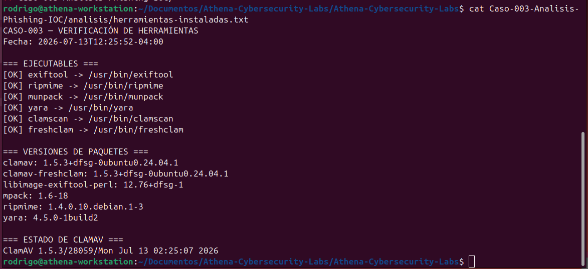
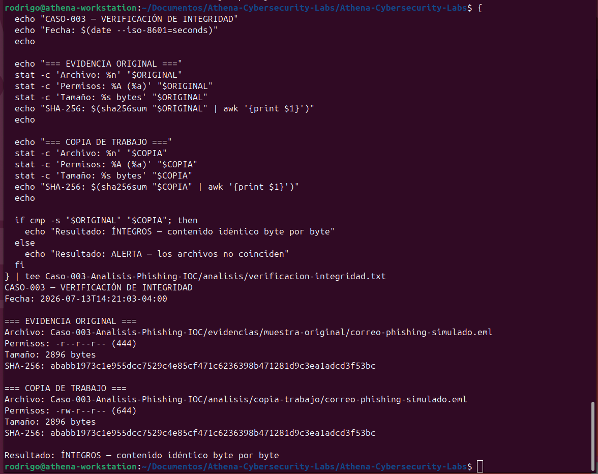
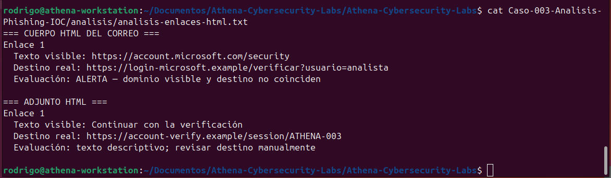
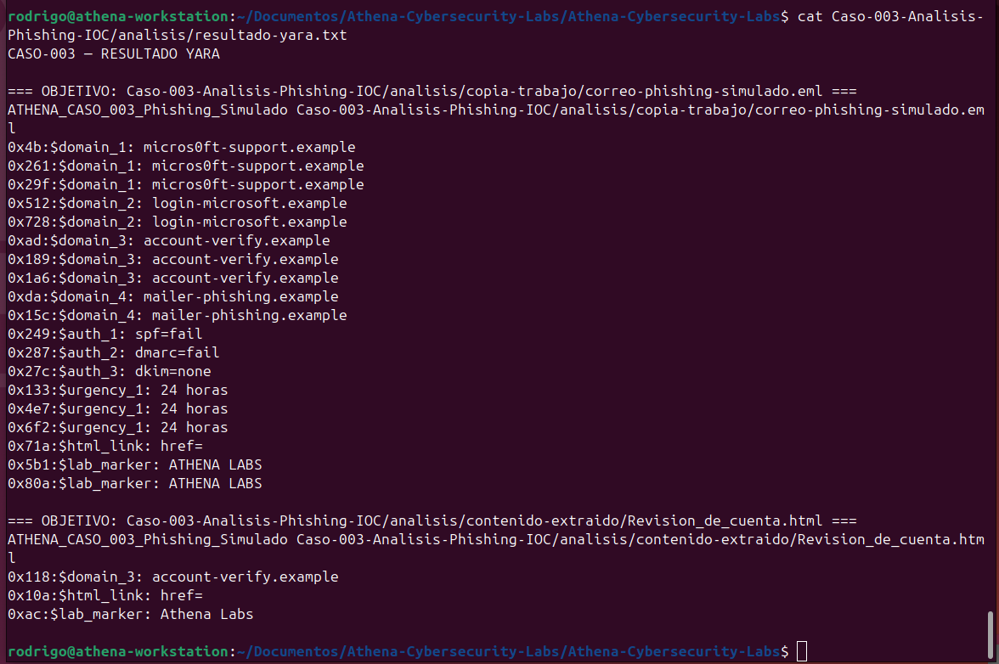

# CASO-003 — Análisis de Phishing e Indicadores de Compromiso

**Fecha de análisis:** 13 de julio de 2026  
**Estado del caso:** Completado  
**Clasificación:** Blue Team / Análisis de phishing y respuesta a incidentes  
**Veredicto:** Phishing confirmado — simulación controlada

## Resumen

Se construyó y analizó una muestra controlada de correo electrónico orientada a simular una campaña de phishing para robo de credenciales.

La investigación incluyó preservación de evidencia, cálculo de hashes, revisión de encabezados, análisis de autenticación, inspección de la estructura MIME, extracción segura del adjunto, identificación y validación de IOC, análisis antivirus y desarrollo de una regla YARA propia.

El correo presentó suplantación visual de marca, discrepancias entre remitente y dirección de respuesta, fallos de SPF y DMARC, ausencia de DKIM, lenguaje de urgencia, un enlace HTML engañoso y un archivo adjunto que redirigía hacia infraestructura simulada.

## Objetivos

- Preparar un entorno de análisis reproducible.
- Preservar la muestra original y verificar su integridad.
- Analizar encabezados y mecanismos de autenticación.
- Examinar la estructura MIME sin abrir el correo.
- Extraer y validar indicadores de compromiso.
- Identificar discrepancias entre enlaces visibles y destinos reales.
- Comparar la detección antivirus con una regla YARA personalizada.
- Clasificar el incidente y proponer acciones de respuesta.

## Alcance y seguridad

La muestra fue generada localmente con fines educativos y utiliza exclusivamente dominios reservados bajo `.example`, la IP documental `203.0.113.77` y un adjunto HTML sin JavaScript, formularios ni código ejecutable.

No se visitaron URL ni se ejecutó contenido durante el análisis.

## Entorno del laboratorio

- Ubuntu 24.04.4 LTS
- Kernel 6.17.0-35-generic
- Arquitectura x86_64
- Python 3
- ExifTool, ripMIME y munpack
- YARA 4.5.0
- ClamAV 1.5.3



## Metodología

### 1. Preparación y línea base

Se creó una estructura separada para evidencia original, copias de trabajo, resultados, indicadores y reportes. También se registraron el sistema operativo y las herramientas disponibles antes del análisis.

### 2. Adquisición y preservación

La muestra original fue almacenada con permisos `0444`. Posteriormente se creó una copia de trabajo y se verificó su igualdad byte por byte mediante `cmp` y SHA-256.

**SHA-256 del correo:**

```text
ababb1973c1e955dcc7529c4e85cf471c6236398b471281d9c3ea1adcd3f53bc
```



### 3. Análisis de encabezados

- Remitente: `seguridad@micros0ft-support.example`
- Reply-To: `verificacion@account-verify.example`
- Return-Path: `rebotes@mailer-phishing.example`
- IP declarada de origen: `203.0.113.77`
- SPF: `fail`
- DKIM: `none`
- DMARC: `fail`

El dominio `micros0ft-support.example` utiliza el número cero para imitar visualmente la palabra Microsoft.

### 4. Estructura MIME y adjunto

La muestra contenía un cuerpo `text/plain`, otro `text/html` y el adjunto `Revision_de_cuenta.html` codificado en Base64.

**SHA-256 del adjunto:**

```text
d4079a832e8ba4b17cdab87c7556908455bdef4c4c2ccc1a05a3c07acfaaaffa
```

El hash calculado antes de la extracción coincidió con el archivo extraído mediante ripMIME.

### 5. Análisis del enlace engañoso

El cuerpo mostraba `https://account.microsoft.com/security`, pero el destino real era:

```text
https://login-microsoft.example/verificar?usuario=analista
```

La discrepancia confirmó una técnica de suplantación destinada a generar confianza.



## Indicadores validados

### URL sospechosas

```text
https://login-microsoft.example/verificar?usuario=analista
https://account-verify.example/session/ATHENA-003
```

### Dominios sospechosos

```text
micros0ft-support.example
login-microsoft.example
account-verify.example
mail.account-verify.example
mailer-phishing.example
```

### Dirección IP

```text
203.0.113.77
```

### Direcciones de correo

```text
seguridad@micros0ft-support.example
verificacion@account-verify.example
rebotes@mailer-phishing.example
```

La extracción automática produjo falsos positivos que fueron depurados manualmente para evitar clasificaciones incorrectas.

## Resultados de detección

### ClamAV

ClamAV analizó dos archivos, detectó cero infecciones y finalizó con código `0`. El resultado era esperado porque la muestra no contenía malware; aun así, el mensaje fue clasificado como phishing por sus técnicas de suplantación e ingeniería social.

### YARA

Se desarrolló la regla `ATHENA_CASO_003_Phishing_Simulado`, que detectó dominios de la simulación, fallos de autenticación, lenguaje de urgencia, enlaces HTML y la marca de control de Athena Labs. La detección fue positiva para el correo y el adjunto.



## MITRE ATT&CK

- **T1566.001 — Phishing: Spearphishing Attachment:** archivo HTML adjunto como mecanismo de redirección.
- **T1566.002 — Phishing: Spearphishing Link:** enlace engañoso dirigido hacia infraestructura fraudulenta.

## Clasificación del incidente

- **Veredicto:** phishing confirmado.
- **Categoría:** robo de credenciales.
- **Riesgo potencial:** alto.
- **Impacto real:** ninguno.
- **Confianza analítica:** alta.
- **Estado:** contenido y analizado.

## Acciones de respuesta recomendadas

1. Poner el mensaje en cuarentena.
2. Bloquear los IOC validados.
3. Buscar correos similares en otros buzones.
4. Revisar registros de correo, DNS, proxy e identidad.
5. Identificar usuarios que hayan interactuado con el mensaje.
6. Revocar sesiones y restablecer credenciales si hubo ingreso de datos.
7. Aislar y analizar el endpoint si se ejecutó algún adjunto.
8. Preservar la evidencia y documentar todas las acciones.

## Estructura del caso

```text
Caso-003-Analisis-Phishing-IOC/
├── README.md
├── analisis/
│   ├── copia-trabajo/
│   ├── contenido-extraido/
│   └── resultados del análisis
├── evidencias/
│   ├── capturas/
│   └── muestra-original/
├── indicadores/
│   ├── reglas-yara/
│   ├── ioc-extraidos.txt
│   └── ioc-validados.txt
└── reportes/
    ├── evaluacion-incidente.md
    └── registro-adquisicion.txt
```

## Conclusiones

El caso demostró que un correo puede representar una amenaza seria aunque no contenga malware y obtenga un resultado limpio en un análisis antivirus.

La combinación de encabezados inconsistentes, autenticación fallida, suplantación visual, urgencia, enlaces engañosos y adjuntos HTML permitió confirmar el phishing con alta confianza. La validación manual de IOC fue fundamental para separar indicadores accionables de falsos positivos.

La regla YARA desarrollada transformó los hallazgos de la investigación en una capacidad de detección reutilizable para Athena Labs.

---

> Laboratorio educativo ejecutado de forma controlada. No se utilizó infraestructura maliciosa real.
