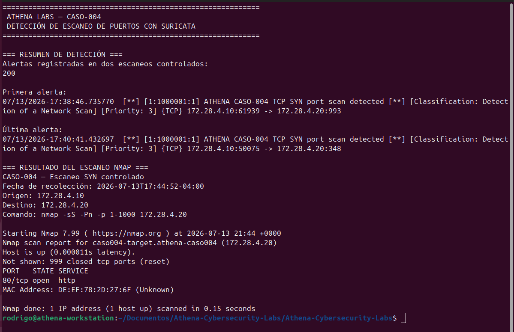

# CASO-004 — Detección de escaneo de puertos con Suricata

**Fecha del laboratorio:** 13 de julio de 2026  
**Estado:** Completado  
**Clasificación:** Blue Team / Network Security Monitoring / IDS  
**Entorno:** Ubuntu, Docker, Suricata y Nmap

## Resumen

Se construyó un laboratorio controlado para generar, detectar y analizar un escaneo TCP SYN contra un servidor web desplegado en una red Docker aislada.

Un contenedor con herramientas de red actuó como origen del reconocimiento y ejecutó Nmap contra un contenedor Nginx. Suricata operó como sistema de detección de intrusiones de red sobre la interfaz bridge creada exclusivamente para el caso.

La actividad fue identificada mediante una regla local con umbral, registrada en `fast.log` y `eve.json`, y posteriormente analizada desde la perspectiva de un operador SOC.

## Objetivos

- Construir una red de laboratorio aislada de la red doméstica.
- Generar un escaneo TCP SYN controlado con Nmap.
- Monitorear el tráfico de la red Docker con Suricata en modo IDS.
- Crear y validar una firma local para detectar reconocimiento de puertos.
- Analizar IP de origen, destino, protocolo, puertos, severidad y acción.
- Preservar la topología, los registros y la regla utilizada.
- Verificar la integridad de las evidencias mediante SHA-256.
- Relacionar la actividad detectada con MITRE ATT&CK.

## Alcance y consideraciones éticas

Toda la actividad se realizó en infraestructura propia y autorizada.

El tráfico se limitó a la red Docker `172.28.4.0/24`. No se escaneó la red doméstica, ningún sistema de terceros ni servicios expuestos a Internet.

## Arquitectura del laboratorio

| Componente | Función | Dirección / interfaz |
|---|---|---|
| `caso004-attacker` | Origen del escaneo Nmap | `172.28.4.10` |
| `caso004-target` | Servidor web Nginx objetivo | `172.28.4.20` |
| `athena-caso004` | Red Docker aislada | `172.28.4.0/24` |
| Suricata | Sensor IDS ejecutado en Ubuntu | `br-84d7f5d615a2` |
| Nginx | Servicio accesible en el objetivo | `80/tcp` |

```text
caso004-attacker                     caso004-target
172.28.4.10                          172.28.4.20
       |                                    |
       +--------- athena-caso004 -----------+
                  172.28.4.0/24
                         |
                 br-84d7f5d615a2
                         |
                  Suricata 7.0.3
                      Modo IDS
```

## Herramientas utilizadas

| Herramienta | Uso en el laboratorio |
|---|---|
| Docker | Aislamiento y despliegue de los sistemas |
| `nicolaka/netshoot` | Contenedor con Nmap y utilidades de red |
| `nginx:alpine` | Servicio objetivo |
| Nmap 7.99 | Generación del escaneo TCP SYN |
| Suricata 7.0.3 | Inspección del tráfico y emisión de alertas |
| SHA-256 | Verificación de integridad de evidencias |

## Preparación del entorno

### 1. Creación de la red aislada

```bash
docker network create \
  --driver bridge \
  --subnet 172.28.4.0/24 \
  athena-caso004
```

### 2. Despliegue del objetivo

```bash
docker run -d \
  --name caso004-target \
  --network athena-caso004 \
  --ip 172.28.4.20 \
  nginx:alpine
```

### 3. Despliegue del origen del escaneo

```bash
docker run -d \
  --name caso004-attacker \
  --network athena-caso004 \
  --ip 172.28.4.10 \
  nicolaka/netshoot \
  sleep infinity
```

### 4. Validación de conectividad

```bash
docker exec caso004-attacker \
  curl -sS -o /dev/null -w \
  'HTTP %{http_code} desde %{local_ip} hacia %{remote_ip}\n' \
  http://172.28.4.20
```

Resultado esperado:

```text
HTTP 200 desde 172.28.4.10 hacia 172.28.4.20
```

## Regla de detección

Se creó la siguiente firma local:

```suricata
alert tcp 172.28.4.10 any -> 172.28.4.20 any (msg:"ATHENA CASO-004 TCP SYN port scan detected"; flags:S; flow:stateless; threshold:type threshold, track by_src, count 10, seconds 5; classtype:network-scan; sid:1000001; rev:1;)
```

### Lógica de la firma

| Campo | Interpretación |
|---|---|
| `alert tcp` | Genera una alerta ante tráfico TCP coincidente |
| `172.28.4.10 any` | Limita el origen al contenedor atacante |
| `172.28.4.20 any` | Limita el destino al objetivo controlado |
| `flags:S` | Busca paquetes con bandera SYN |
| `flow:stateless` | Evalúa cada paquete sin exigir una sesión establecida |
| `track by_src` | Mantiene el conteo por dirección de origen |
| `count 10, seconds 5` | Emite una alerta por cada diez coincidencias dentro de cinco segundos |
| `classtype:network-scan` | Clasifica el evento como escaneo de red |
| `sid:1000001` | Identificador local de la firma |

La regla fue validada antes de iniciar la captura:

```bash
sudo suricata -T \
  -c /etc/suricata/suricata.yaml \
  -S /var/lib/suricata/rules/caso004.rules
```

Resultado:

```text
Configuration provided was successfully loaded. Exiting.
```

## Ejecución del sensor

Suricata se inició manualmente sobre la interfaz exclusiva del laboratorio:

```bash
sudo suricata \
  -D \
  -c /etc/suricata/suricata.yaml \
  -S /var/lib/suricata/rules/caso004.rules \
  -i br-84d7f5d615a2 \
  -l /var/log/suricata-caso004 \
  --pidfile /run/suricata-caso004.pid
```

El parámetro `-S` permitió cargar exclusivamente la firma controlada para esta prueba. Suricata se mantuvo en modo IDS: observó y alertó, pero no bloqueó conexiones.

La línea base previa al ataque no contenía alertas.

## Generación del escaneo

Desde el contenedor atacante se examinaron los primeros 1.000 puertos TCP mediante un escaneo SYN:

```bash
docker exec caso004-attacker \
  nmap -sS -Pn -p 1-1000 --reason 172.28.4.20
```

Parámetros relevantes:

| Parámetro | Función |
|---|---|
| `-sS` | Ejecuta un escaneo TCP SYN |
| `-Pn` | Omite el descubrimiento previo del host |
| `-p 1-1000` | Examina los puertos TCP del 1 al 1000 |
| `--reason` | Explica la razón del estado asignado a cada puerto |

## Resultados

Nmap identificó el objetivo activo y un único servicio abierto:

```text
Host is up.
Not shown: 999 closed tcp ports (reset)

PORT   STATE SERVICE
80/tcp open  http
```

Suricata registró la actividad con la firma local:

```text
[1:1000001:1] ATHENA CASO-004 TCP SYN port scan detected
[Classification: Detection of a Network Scan]
[Priority: 3]
{TCP} 172.28.4.10 -> 172.28.4.20
```

### Métricas finales

| Métrica | Resultado |
|---|---:|
| Escaneos monitoreados | 2 |
| Puertos examinados por ejecución | 1.000 |
| Alertas por ejecución | 100 |
| Alertas acumuladas | 200 |
| Paquetes procesados por Suricata | 4.012 |
| Paquetes perdidos | 0 |
| Tasa de pérdida | 0,00 % |
| Checksums inválidos | 0 |
| Tiempo activo del sensor | 237,677 s |
| Puerto abierto identificado | `80/tcp` |

La proporción de 100 alertas por cada 1.000 intentos coincide con el umbral configurado: una alerta por cada diez paquetes SYN coincidentes.

## Evidencia visual



La captura consolida el total de alertas, el primer y último evento, las direcciones involucradas y el resultado preservado del escaneo.

## Análisis SOC

### Indicadores observados

| Indicador | Valor |
|---|---|
| IP de origen | `172.28.4.10` |
| IP de destino | `172.28.4.20` |
| Protocolo | TCP |
| Patrón | Múltiples SYN hacia distintos puertos |
| Puerto accesible | `80/tcp` |
| Firma | `ATHENA CASO-004 TCP SYN port scan detected` |
| SID | `1000001` |
| Categoría | `Detection of a Network Scan` |
| Severidad | 3 |
| Acción | `allowed` |

### Interpretación

La combinación de una única dirección de origen, numerosos puertos de destino y una ventana temporal extremadamente breve es consistente con una actividad automatizada de descubrimiento de servicios.

La acción `allowed` no representa un fallo. El sensor se ejecutó como IDS y, por diseño, su función fue detectar y registrar. Un despliegue preventivo requeriría modo IPS y controles adicionales en línea.

### Hipótesis de análisis

En una red productiva, este patrón podría corresponder a:

- reconocimiento previo a un intento de intrusión;
- inventario o monitoreo autorizado;
- una herramienta de gestión mal configurada;
- actividad automatizada no autorizada dentro de la red.

La alerta debe contextualizarse con inventarios, ventanas de mantenimiento, propietario del activo y actividad posterior del origen antes de escalarla como incidente confirmado.

## Mapeo MITRE ATT&CK

| Táctica | Técnica | Relación con el caso |
|---|---|---|
| Discovery | **T1046 — Network Service Discovery** | Nmap examinó múltiples puertos para identificar servicios accesibles en el objetivo |

El laboratorio reproduce únicamente la fase de descubrimiento. No se realizaron explotación, acceso inicial, persistencia ni acciones sobre el objetivo.

## Recomendaciones defensivas

1. Mantener sensores IDS correctamente ubicados en segmentos críticos.
2. Ajustar umbrales según el comportamiento normal de cada red.
3. Correlacionar alertas de escaneo con autenticaciones, DNS, proxy y endpoint.
4. Mantener un inventario de escáneres y tareas de administración autorizadas.
5. Restringir servicios y puertos mediante segmentación y reglas de firewall.
6. Investigar actividad posterior proveniente de la misma dirección de origen.
7. Integrar `eve.json` con un SIEM para búsqueda, correlación y visualización.
8. Revisar falsos positivos antes de aplicar bloqueos automáticos.

## Estructura de evidencias

```text
evidencias/
├── 01_topologia/
│   ├── docker-containers-inspect.json
│   ├── docker-network-inspect.json
│   └── interfaz-bridge.txt
├── 02_ataque/
│   └── nmap-syn-scan.txt
├── 03_suricata/
│   ├── caso004.rules
│   ├── eve.json
│   ├── fast.log
│   ├── stats.log
│   └── suricata.log
├── 04_integridad/
│   └── SHA256SUMS.txt
└── inventario-tecnico.txt
```

## Verificación de integridad

Las evidencias y la captura fueron protegidas mediante hashes SHA-256.

Desde el directorio del caso:

```bash
sha256sum -c evidencias/04_integridad/SHA256SUMS.txt
```

Todos los archivos incluidos en el manifiesto devolvieron:

```text
La suma coincide
```

## Cierre del laboratorio

Suricata fue detenido de forma ordenada mediante `SIGTERM`. El registro final confirmó:

```text
Alerts: 200
packets: 4012
drops: 0 (0.00%)
invalid chksum: 0
```

Después de preservar y verificar las evidencias, se eliminaron los dos contenedores y la red `athena-caso004`. Open WebUI permaneció activo y saludable durante todo el procedimiento.

## Conclusión

El laboratorio demostró el ciclo completo de una detección de red: diseño seguro del entorno, generación controlada de actividad, creación de lógica de detección, monitoreo, análisis SOC, preservación de evidencias y desmontaje limpio.

Suricata detectó correctamente el patrón de escaneo TCP SYN generado por Nmap, procesó el tráfico sin pérdida de paquetes y produjo registros utilizables tanto para revisión directa como para una futura integración con SIEM.

Este caso aporta experiencia práctica en monitoreo de seguridad de red, desarrollo de firmas, análisis de alertas y documentación reproducible orientada a operaciones Blue Team.

---

**Athena Cybersecurity Labs**  
Laboratorio desarrollado exclusivamente con fines educativos y defensivos.
