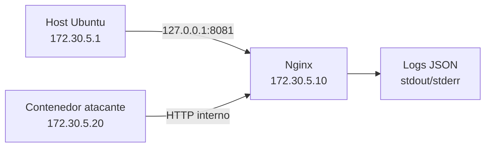
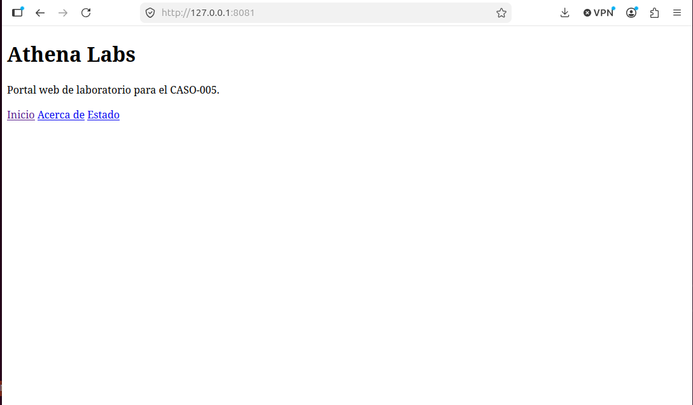
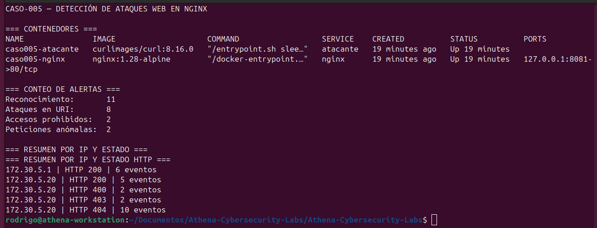

# CASO-005 — Detección de Ataques Web en Nginx


## Resumen ejecutivo

En este caso se construyó un laboratorio web aislado y reproducible para generar, registrar y detectar actividad hostil contra un servidor Nginx. El entorno separó un servidor web y un cliente atacante mediante una red Docker dedicada, manteniendo la publicación del servicio limitada a la interfaz local del host.

La simulación incluyó reconocimiento automatizado, enumeración de rutas, intentos de acceso a recursos sensibles, una sonda de SQL injection, una sonda de cross-site scripting (XSS) y solicitudes de path traversal. Nginx registró los eventos en JSON y un detector en Bash con `jq` clasificó la actividad por técnica, origen y estado HTTP.

Todas las pruebas fueron ejecutadas en un entorno controlado. No se produjo exposición de archivos, ejecución de código ni compromiso del servidor.

## Datos del caso

| Campo | Valor |
|---|---|
| Caso | CASO-005 |
| Nombre | Detección de Ataques Web en Nginx |
| Fecha | 13 de julio de 2026 |
| Clasificación | Blue Team / Detección web |
| Estado | Completado |
| Servidor | Nginx 1.28 Alpine |
| Cliente de pruebas | curl 8.16.0 |
| Orquestación | Docker Compose |
| Formato de logs | JSON Lines |
| Red aislada | `172.30.5.0/24` |

## Objetivos

- Desplegar un servidor Nginx en una red Docker aislada.
- Publicar el portal únicamente en `127.0.0.1:8081`.
- Establecer una línea base de tráfico legítimo.
- Simular reconocimiento y sondas de ataque web sin explotar sistemas externos.
- Registrar eventos estructurados con información útil para Blue Team.
- Automatizar la detección mediante Bash y `jq`.
- Preservar evidencias y verificar su integridad con SHA-256.

## Alcance y seguridad

El laboratorio opera exclusivamente sobre contenedores locales y una red privada creada para el caso. La dirección del atacante, las rutas consultadas y los payloads pertenecen al entorno de práctica.

La publicación de Nginx utiliza el enlace:

```text
127.0.0.1:8081:80
```

Esto evita exponer el servicio en todas las interfaces de red del host.

> Este material debe utilizarse únicamente en sistemas propios o con autorización expresa.

## Arquitectura



| Componente | Imagen | Dirección | Función |
|---|---|---|---|
| Servidor web | `nginx:1.28-alpine` | `172.30.5.10` | Portal, control de acceso y generación de logs |
| Atacante controlado | `curlimages/curl:8.16.0` | `172.30.5.20` | Generación de tráfico legítimo y hostil |
| Host Ubuntu | Sistema anfitrión | `172.30.5.1` en la red bridge | Administración y acceso local al portal |

## Estructura del caso

```text
Caso-005-Deteccion-Ataques-Web-Nginx/
├── README.md
├── capturas/
│   ├── 02_portal_nginx.png
│   └── 03_deteccion_automatica.png
├── evidencias/
│   ├── 01_topologia/
│   ├── 02_trafico_legitimo/
│   ├── 03_ataque/
│   ├── 04_logs_nginx/
│   ├── 05_analisis/
│   └── 06_integridad/
└── lab/
    ├── compose.yaml
    ├── detectar_ataques.sh
    └── nginx/
        ├── conf.d/caso005.conf
        └── html/
            ├── about.html
            └── index.html
```

## Configuración de registro

Nginx utiliza un formato JSON personalizado con los siguientes campos:

| Campo | Descripción |
|---|---|
| `timestamp` | Fecha y hora ISO 8601 del evento |
| `remote_addr` | Dirección IP de origen |
| `request_method` | Método HTTP |
| `request_uri` | Ruta y parámetros solicitados |
| `status` | Código de respuesta HTTP |
| `body_bytes_sent` | Bytes enviados al cliente |
| `http_referer` | Referente HTTP |
| `http_user_agent` | Identificador del cliente |
| `request_time` | Tiempo de procesamiento |

Ejemplo:

```json
{"timestamp":"2026-07-13T22:22:56+00:00","remote_addr":"172.30.5.20","request_method":"GET","request_uri":"/login?user=admin%27+OR+%271%27%3d%271&password=test","status":404,"body_bytes_sent":153,"http_referer":"","http_user_agent":"Athena-Labs-Attack/1.0","request_time":0.000}
```

## Desarrollo del laboratorio

### 1. Inicio y validación

```bash
CASO="Caso-005-Deteccion-Ataques-Web-Nginx"

docker compose -f "$CASO/lab/compose.yaml" pull
docker compose -f "$CASO/lab/compose.yaml" up -d
docker compose -f "$CASO/lab/compose.yaml" ps
docker exec caso005-nginx nginx -t
```

Validación del portal y del endpoint de salud:

```bash
curl -i http://127.0.0.1:8081/
curl -i http://127.0.0.1:8081/health
```

Resultados observados:

- Portal principal: `HTTP 200`.
- Página informativa: `HTTP 200`.
- Endpoint `/health`: `HTTP 200` con respuesta `OK`.
- Configuración Nginx: sintaxis válida.
- Ambos contenedores: estado `Up`.

### 2. Línea base legítima

Se generaron solicitudes desde el host y desde el contenedor atacante hacia:

```text
/
/about.html
/health
```

Las solicitudes legítimas respondieron `HTTP 200`. Para marcar una comprobación de control se utilizó el agente:

```text
Athena-Labs-Baseline/1.0
```

La línea base permitió comparar el comportamiento normal con las fases posteriores.

### 3. Reconocimiento y enumeración

El cliente controlado consultó once rutas en un intervalo de un segundo:

```text
/
/about.html
/robots.txt
/login
/admin
/admin/
/.env
/.git/config
/wp-login.php
/phpmyadmin
/backup.zip
```

Distribución de respuestas:

| Estado | Eventos | Interpretación |
|---:|---:|---|
| `200` | 2 | Recursos públicos encontrados |
| `403` | 2 | Acceso denegado a `/admin` |
| `404` | 7 | Recursos inexistentes o no expuestos |

El patrón —múltiples rutas sensibles, numerosos `403/404`, mismo origen y alta velocidad— es consistente con enumeración automatizada.

### 4. Sondas de ataque web

Se ejecutaron sondas inocuas diseñadas para dejar indicadores detectables en `request_uri`.

| Técnica | Recurso | Resultado |
|---|---|---:|
| SQL injection | `/login` con operadores y comillas codificadas | `404` |
| XSS | `/search` con etiqueta `script` codificada | `404` |
| Archivo sensible | `/.env` | `404` |
| Path traversal | Secuencias `../` y `%2e%2e/` | `400` |

Los intentos de path traversal fueron rechazados durante el procesamiento inicial de la petición. En estos eventos Nginx registró una URI vacía y no alcanzó a procesar el `User-Agent`:

```json
{"remote_addr":"172.30.5.20","request_method":"GET","request_uri":"","status":400,"http_user_agent":""}
```

Este comportamiento evidencia que la solicitud malformada fue bloqueada antes de llegar al contenido web.

## Detección automática

El script [`lab/detectar_ataques.sh`](lab/detectar_ataques.sh) analiza el log con `jq` y genera cuatro clases de alerta:

1. `RECON`: actividad marcada como reconocimiento automatizado.
2. `WEB-ATTACK`: indicadores sospechosos dentro de la URI.
3. `FORBIDDEN`: accesos con respuesta `HTTP 403`.
4. `MALFORMED`: peticiones `HTTP 400` con URI vacía.

Ejecución:

```bash
./Caso-005-Deteccion-Ataques-Web-Nginx/lab/detectar_ataques.sh
```

También puede recibir una ruta de log específica:

```bash
./Caso-005-Deteccion-Ataques-Web-Nginx/lab/detectar_ataques.sh \
  ./Caso-005-Deteccion-Ataques-Web-Nginx/evidencias/04_logs_nginx/nginx_completo.log
```

## Resultados

### Conteo de alertas

| Categoría | Eventos detectados |
|---|---:|
| Reconocimiento | 11 |
| Indicadores de ataque en URI | 8 |
| Accesos prohibidos | 2 |
| Solicitudes malformadas | 2 |

### Resumen por origen y estado HTTP

| Origen | Estado | Eventos |
|---|---:|---:|
| `172.30.5.1` | `200` | 6 |
| `172.30.5.20` | `200` | 5 |
| `172.30.5.20` | `400` | 2 |
| `172.30.5.20` | `403` | 2 |
| `172.30.5.20` | `404` | 10 |

### Hallazgos principales

- Toda la actividad hostil se originó en `172.30.5.20`.
- El host `172.30.5.1` produjo únicamente respuestas exitosas durante la línea base.
- Nginx denegó los accesos al área administrativa mediante `HTTP 403`.
- Los archivos y aplicaciones sensibles consultados no estaban expuestos.
- Las sondas SQLi y XSS quedaron preservadas en los parámetros codificados.
- Las solicitudes de traversal fueron rechazadas con `HTTP 400`.
- No se observó acceso no autorizado, exposición de información ni compromiso.

## Evidencias visuales

### Portal web del laboratorio



### Detección automática y resumen por IP



## Evidencias preservadas

| Directorio | Contenido |
|---|---|
| `01_topologia` | Estado, metadatos, red e inspección de contenedores |
| `02_trafico_legitimo` | Línea base en JSONL |
| `03_ataque` | Enumeración, sondas y solicitudes malformadas |
| `04_logs_nginx` | Log completo y configuración efectiva de Nginx |
| `05_analisis` | Informe de eventos y alertas detectadas |
| `06_integridad` | Manifiesto SHA-256 |

## Integridad

Se calcularon hashes SHA-256 para las evidencias y capturas. La verificación final confirmó la coincidencia de los 14 archivos protegidos.

Hash SHA-256 del manifiesto final:

```text
c3254d0a384823cfda8f22e09931db923d6266113d6377614fff739568c3de62
```

Verificación desde la raíz del repositorio:

```bash
sha256sum -c \
  Caso-005-Deteccion-Ataques-Web-Nginx/evidencias/06_integridad/manifiesto_sha256.txt
```

## Reproducción rápida

Requisitos:

- Docker Engine con el complemento Docker Compose.
- `curl`.
- `jq` para ejecutar el detector.
- Bash.

Inicio:

```bash
CASO="Caso-005-Deteccion-Ataques-Web-Nginx"
docker compose -f "$CASO/lab/compose.yaml" up -d
curl -i http://127.0.0.1:8081/health
```

Consulta de logs:

```bash
docker logs caso005-nginx 2>&1 | grep '"request_method":'
```

Detección sobre la evidencia preservada:

```bash
"$CASO/lab/detectar_ataques.sh"
```

Cierre:

```bash
docker compose -f "$CASO/lab/compose.yaml" down
```

## Consideraciones defensivas

- Alertar por tasas elevadas de `404` y `403` desde una misma IP.
- Detectar rutas asociadas a archivos de configuración, repositorios y paneles administrativos.
- Analizar tanto rutas decodificadas como representaciones URL-encoded.
- Correlacionar solicitudes `400` con actividad previa del mismo origen.
- Centralizar los logs en un SIEM para aplicar ventanas temporales y contexto histórico.
- Incorporar rate limiting, cabeceras de seguridad y un WAF como controles complementarios.
- Mantener el servicio sin privilegios innecesarios y reducir su superficie de exposición.

## Mapeo de técnicas

| Referencia | Técnica observada |
|---|---|
| MITRE ATT&CK `T1595.002` | Escaneo de vulnerabilidades y rutas web |
| OWASP Injection | Sonda SQL injection en parámetros |
| OWASP Cross-Site Scripting | Payload XSS reflejado como indicador en URI |
| OWASP Security Misconfiguration | Búsqueda de `.env`, `.git` y paneles comunes |
| Path Traversal | Intentos de navegación fuera de la raíz web |

## Conclusión

El CASO-005 demostró un flujo Blue Team completo: despliegue seguro, generación controlada de actividad, registro estructurado, detección automatizada, análisis, preservación de evidencias y verificación criptográfica.

El resultado principal no fue solamente identificar payloads aislados, sino correlacionar el comportamiento del origen atacante: exploración rápida, acceso a rutas sensibles, sondas de inyección y peticiones malformadas. Esta combinación permitió distinguir con claridad el tráfico legítimo de la actividad hostil sin que se produjera un compromiso real.

---

**Athena Cybersecurity Labs** — Laboratorio práctico de detección, análisis y respuesta.
