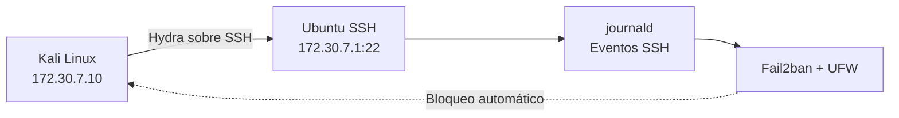
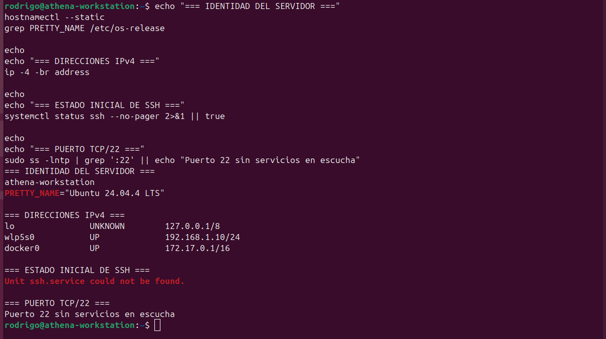
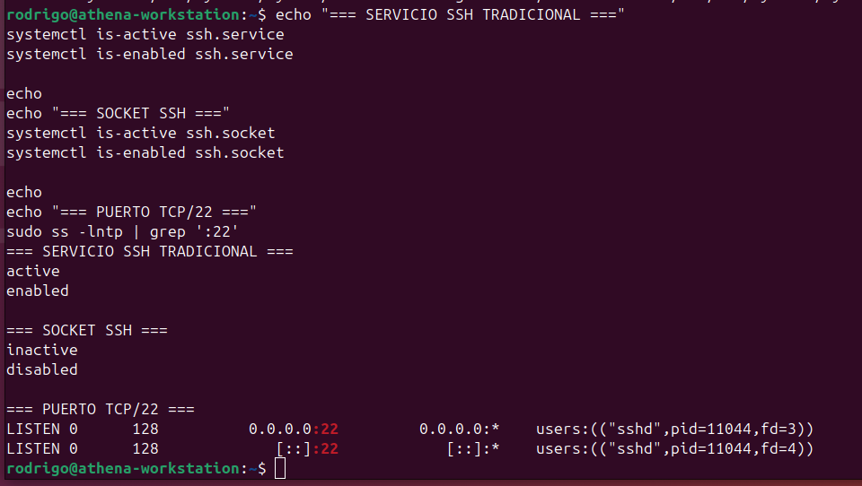
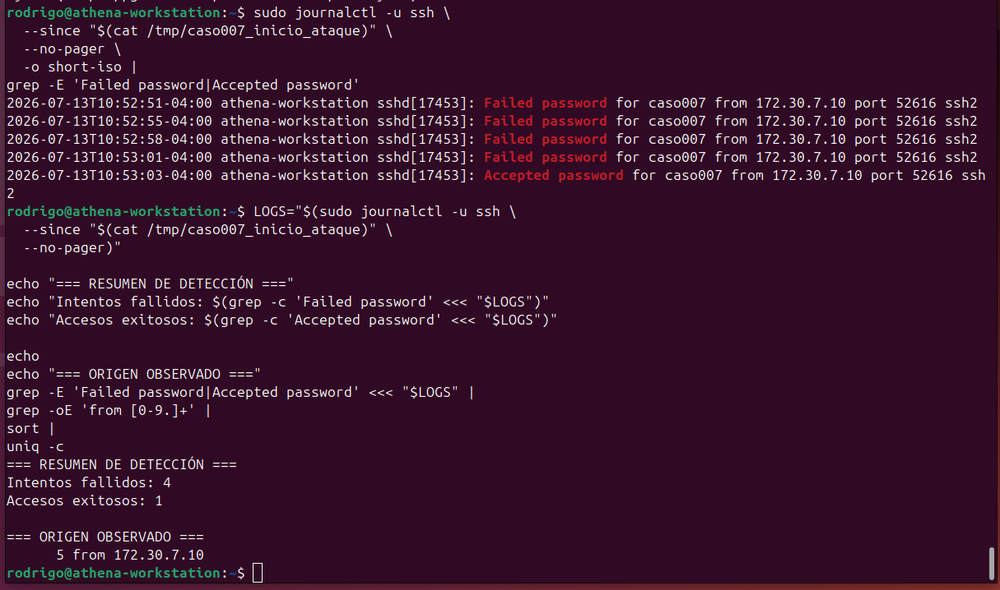
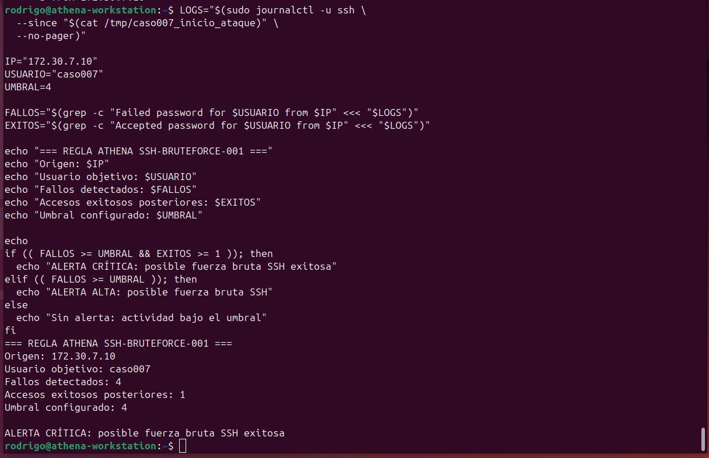
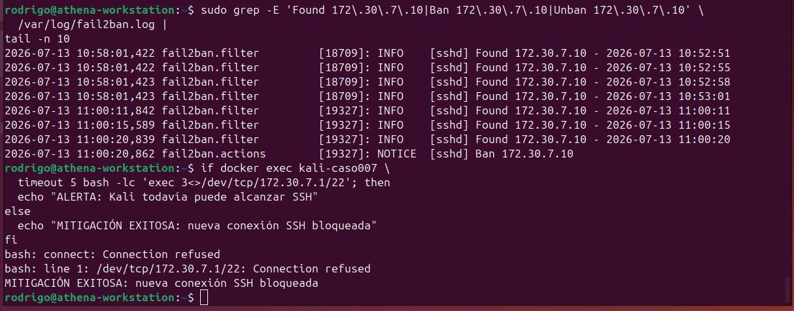
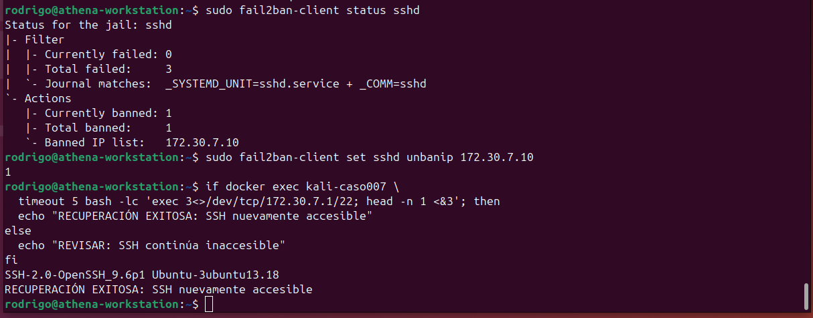
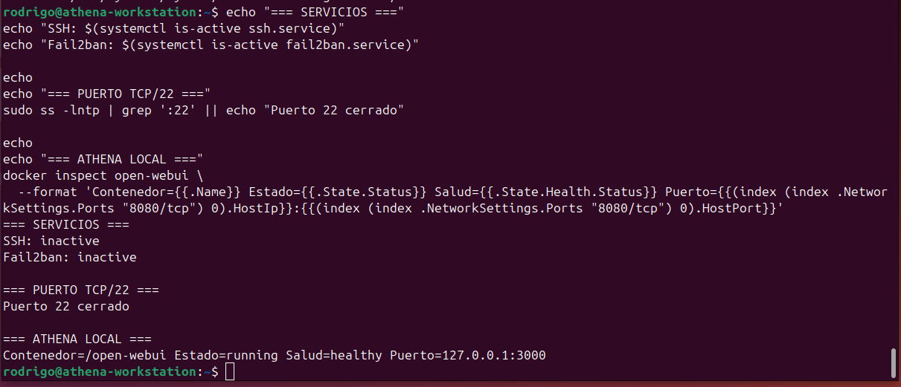

# CASO-007 — Detección y Mitigación de Fuerza Bruta SSH

**Fecha de análisis:** 13 de julio de 2026  
**Estado del caso:** Completado  
**Clasificación:** Blue Team / Detección y respuesta

## Resumen

Se construyó un laboratorio controlado para simular, detectar y mitigar un ataque de fuerza bruta contra un servicio SSH en Ubuntu.

El atacante fue desplegado como un contenedor Kali Linux dentro de una red Docker aislada. Mediante Hydra se generaron intentos de autenticación contra una cuenta señuelo sin privilegios. Los eventos fueron identificados en los registros de OpenSSH, correlacionados mediante una regla de detección y posteriormente mitigados con Fail2ban y UFW.

El laboratorio concluyó con la recuperación del acceso, eliminación de los componentes temporales y cierre del puerto TCP/22.

## Objetivos

- Desplegar un atacante Kali Linux dentro de una red Docker aislada.
- Habilitar temporalmente OpenSSH en Ubuntu.
- Generar intentos controlados de autenticación mediante Hydra.
- Identificar eventos fallidos y exitosos en los registros de SSH.
- Construir una regla básica de detección.
- Mitigar la actividad mediante Fail2ban y UFW.
- Validar el bloqueo y la posterior recuperación.
- Restaurar el sistema a una superficie mínima de exposición.

## Alcance y autorización

Todas las acciones fueron ejecutadas exclusivamente contra infraestructura propia de Athena Labs.

Se utilizó una cuenta señuelo temporal, sin privilegios administrativos y con una contraseña exclusiva para el laboratorio. La credencial fue eliminada y censurada en las evidencias incorporadas al repositorio.

## Entorno

| Componente | Configuración |
|---|---|
| Host defensor | `athena-workstation` |
| Sistema operativo | Ubuntu 24.04.4 LTS |
| Servicio objetivo | OpenSSH Server 9.6p1 |
| Puerto | TCP/22 |
| Atacante | Kali Linux Rolling en Docker |
| Herramienta ofensiva | Hydra 9.7 |
| Red aislada | `172.30.7.0/24` |
| IP del atacante | `172.30.7.10` |
| IP del objetivo en el laboratorio | `172.30.7.1` |
| Cuenta señuelo | `caso007` |
| Firewall | UFW |
| Mitigación | Fail2ban |

## Arquitectura del laboratorio



La regla de UFW permitió el acceso al puerto TCP/22 únicamente desde `172.30.7.10`. La red doméstica permaneció bloqueada por la política predeterminada de denegación entrante.

## Metodología

### 1. Línea base

Se comprobó que OpenSSH Server no estaba instalado y que no existían procesos escuchando en TCP/22.



### 2. Preparación del objetivo

OpenSSH Server fue instalado y configurado como servicio tradicional. Se creó la cuenta señuelo `caso007`, confirmando que no perteneciera al grupo `sudo`.



### 3. Despliegue del atacante

Se creó la red Docker `athena-caso007` con la subred `172.30.7.0/24`. Dentro de ella se desplegó un contenedor Kali Linux con la dirección fija `172.30.7.10`.

La conectividad fue validada antes de ejecutar la simulación.

### 4. Simulación de fuerza bruta

Hydra probó cinco contraseñas contra una única cuenta:

- Cuatro intentos fallidos.
- Una autenticación exitosa.
- Un único origen: `172.30.7.10`.
- Duración aproximada: 12 segundos.

La contraseña temporal fue censurada y la captura original no fue incorporada al repositorio.

### 5. Correlación de eventos

Los registros de OpenSSH mostraron la siguiente secuencia:

| Hora local | Resultado |
|---|---|
| 10:52:51 | Fallo de autenticación |
| 10:52:55 | Fallo de autenticación |
| 10:52:58 | Fallo de autenticación |
| 10:53:01 | Fallo de autenticación |
| 10:53:03 | Autenticación exitosa |

Todos los eventos correspondieron al usuario `caso007` y a la IP `172.30.7.10`.



## Regla de detección

Se definió la regla experimental:

```text
ATHENA SSH-BRUTEFORCE-001
```

### Condición de alerta alta

Cuatro o más fallos de autenticación desde una misma dirección IP contra un mismo usuario.

### Condición de alerta crítica

Cuatro o más fallos seguidos de una autenticación exitosa desde el mismo origen y contra el mismo usuario.

La simulación cumplió la segunda condición:

```text
ALERTA CRÍTICA: posible fuerza bruta SSH exitosa
```



## Mitigación

Fail2ban fue configurado con los siguientes parámetros:

```ini
[sshd]
enabled = true
port = 22
backend = systemd
maxretry = 3
findtime = 60
bantime = 300
banaction = ufw
```

La segunda simulación generó tres fallos dentro de 60 segundos. Fail2ban detectó la actividad y bloqueó automáticamente `172.30.7.10`.

Una nueva conexión al puerto TCP/22 fue rechazada, confirmando que la mitigación estaba operativa.



## Recuperación

La IP atacante fue desbloqueada manualmente mediante Fail2ban. Posteriormente, Kali volvió a recibir el banner de OpenSSH, demostrando la recuperación controlada del servicio.



## Mapeo MITRE ATT&CK

| Técnica | Nombre | Relación con el caso |
|---|---|---|
| [T1110.001](https://attack.mitre.org/techniques/T1110/001/) | Password Guessing | Prueba iterativa de contraseñas contra una cuenta conocida |
| [T1078.003](https://attack.mitre.org/techniques/T1078/003/) | Local Accounts | Uso exitoso de las credenciales de una cuenta local |
| [T1021.004](https://attack.mitre.org/techniques/T1021/004/) | SSH | Acceso al sistema mediante Secure Shell |

La actividad principal corresponde a la táctica **Credential Access**, mediante adivinación de contraseñas.

## Hallazgos

- Los fallos y accesos exitosos quedaron registrados por OpenSSH.
- La IP, el usuario, el puerto de origen y la hora permitieron correlacionar la secuencia.
- Cuatro fallos seguidos de un acceso exitoso constituyeron una señal de alto riesgo.
- Fail2ban detectó tres fallos dentro de la ventana configurada.
- UFW rechazó nuevas conexiones desde la IP bloqueada.
- La cuenta señuelo carecía de privilegios administrativos.
- Athena Local y Open WebUI no fueron afectados durante el laboratorio.

## Limpieza y estado final

Al finalizar se realizaron las siguientes acciones:

- Eliminación de la cuenta `caso007`.
- Eliminación del contenedor Kali.
- Eliminación de la red Docker temporal.
- Eliminación de la regla temporal de UFW.
- Desactivación de OpenSSH y Fail2ban.
- Confirmación del cierre del puerto TCP/22.
- Verificación de Open WebUI en estado `healthy`.



## Evidencias

### Entorno

- `Evidencias/01-Entorno/inventario-herramientas.txt`

### Ataque

- `Evidencias/02-Ataque/resumen-hydra-sanitizado.txt`

### Detección

- `Evidencias/03-Deteccion/eventos-ssh.txt`

### Mitigación

- `Evidencias/04-Mitigacion/configuracion-sshd.local`
- `Evidencias/04-Mitigacion/eventos-fail2ban.txt`

### Cierre

- `Evidencias/05-Cierre/estado-final.txt`

### Capturas

- `Evidencias/06-Capturas/01_linea_base_ssh_no_instalado.png`
- `Evidencias/06-Capturas/02_servicio_ssh_activo.png`
- `Evidencias/06-Capturas/04_linea_base_sin_intentos_fallidos.png`
- `Evidencias/06-Capturas/06_correlacion_logs_ssh.png`
- `Evidencias/06-Capturas/07_alerta_regla_deteccion.png`
- `Evidencias/06-Capturas/08_fail2ban_ip_bloqueada.png`
- `Evidencias/06-Capturas/09_fail2ban_bloqueo_exitoso.png`
- `Evidencias/06-Capturas/10_recuperacion_acceso_ssh.png`
- `Evidencias/06-Capturas/11_estado_final_laboratorio.png`

## Conclusión

El laboratorio demostró el ciclo completo de un incidente de autenticación SSH: preparación, ataque, recolección de registros, correlación, alerta, mitigación, recuperación y cierre.

La combinación de registros de OpenSSH, una regla de detección basada en comportamiento, Fail2ban y UFW permitió identificar y contener la fuerza bruta de manera verificable. El entorno fue restaurado posteriormente a una superficie mínima de exposición, sin afectar los servicios productivos de Athena Local.
